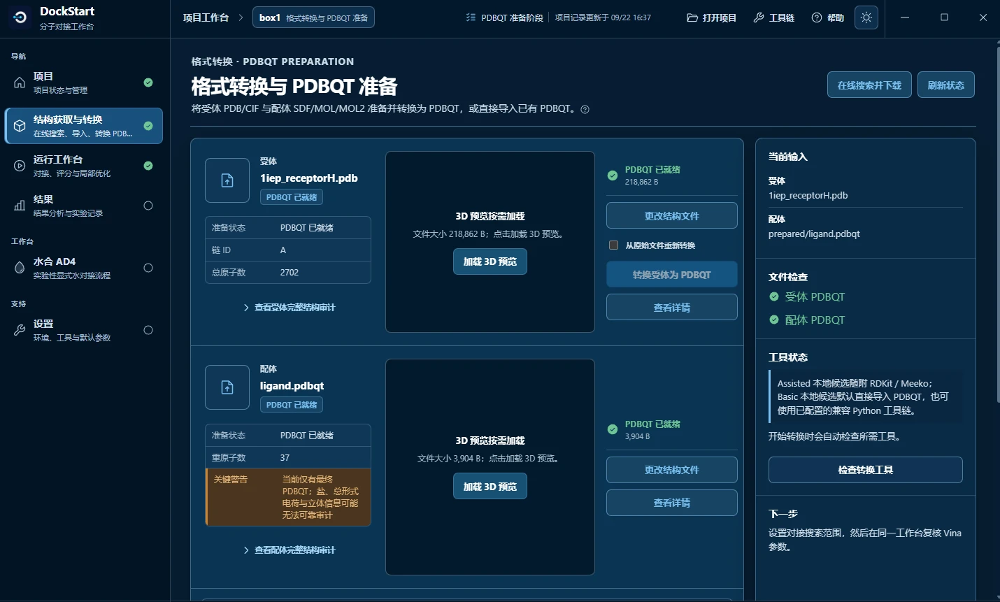
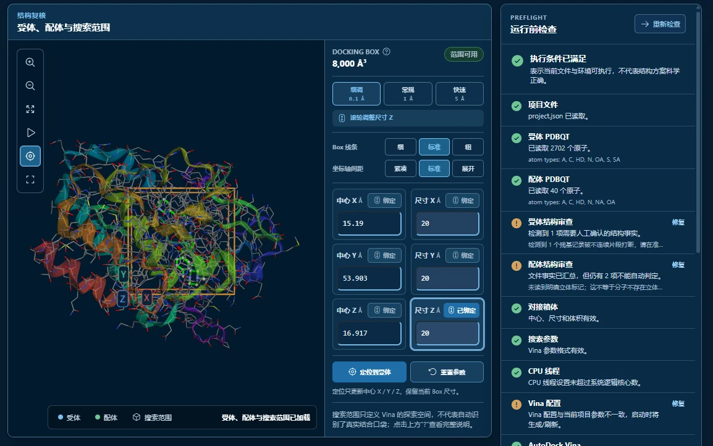
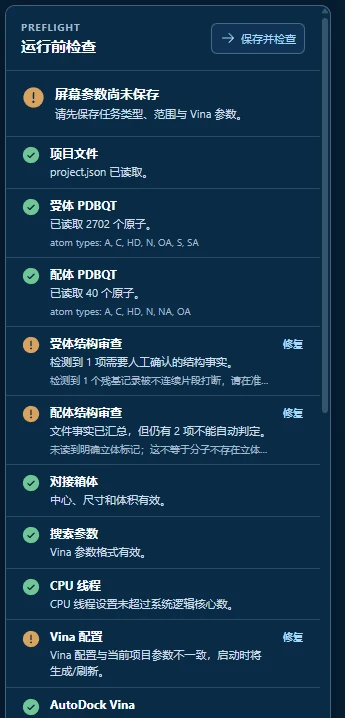
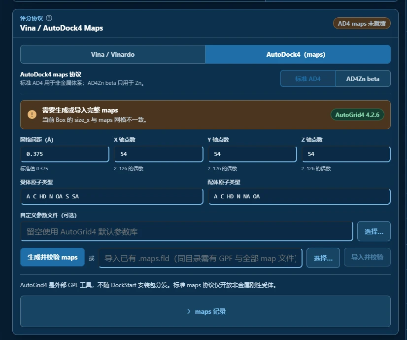
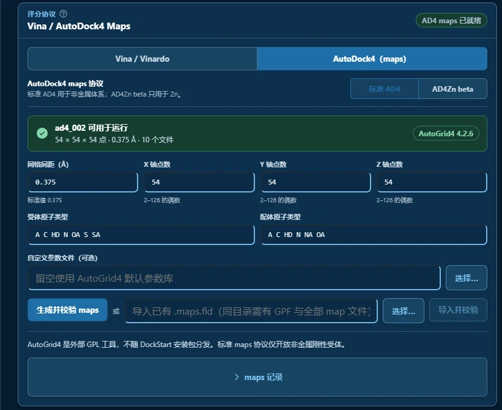
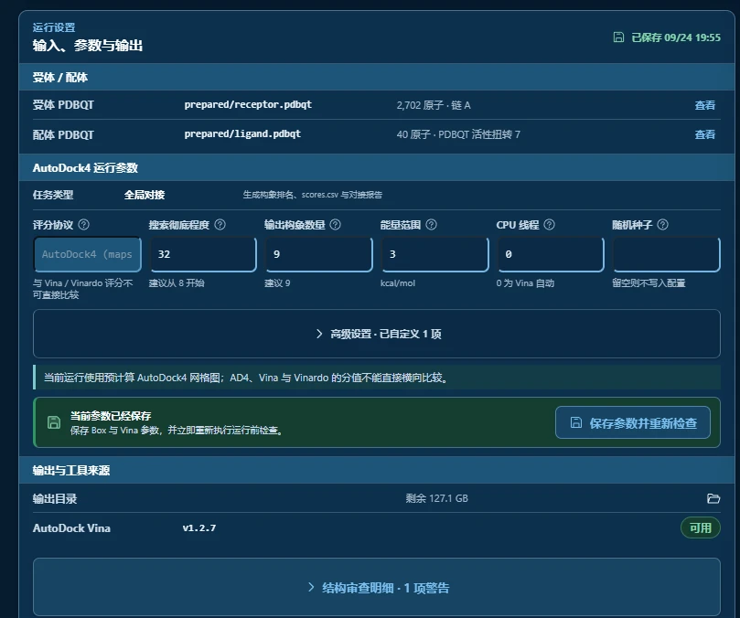
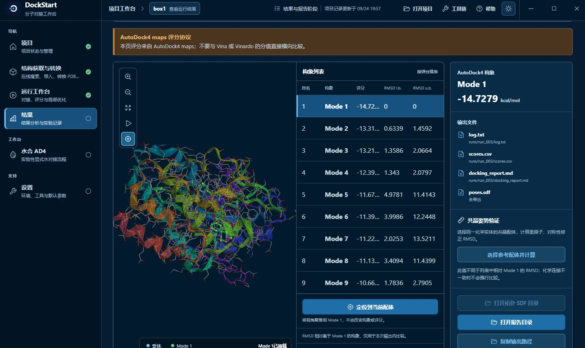
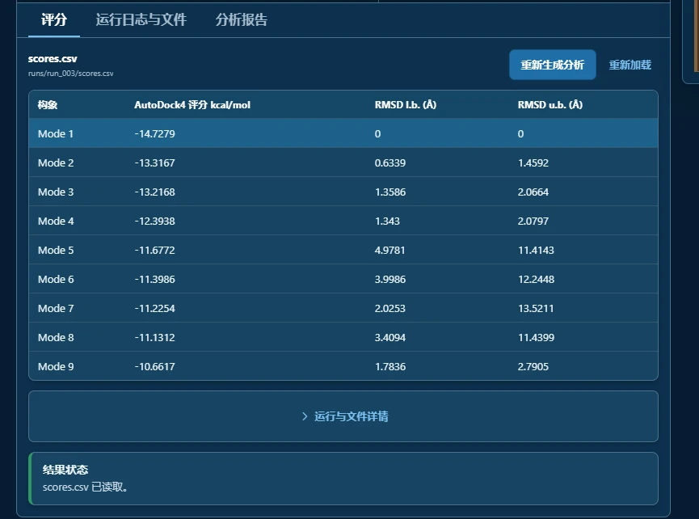

import OfficialExampleFiles from '@site/src/components/OfficialExampleFiles';
import DocNotes, {DocNote, NoteRef} from '@site/src/components/DocNotes';

# AutoDock4 Maps Workflow

在 1IEP 体系中使用 AD4 评分：先由 AutoGrid4 生成 maps，再由 Vina 搜索。开始前配置 [AutoGrid4 4.2.6+](../../part-c/autogrid4-setup.md)。

## 官方三维结构文件 {#official-structure-files}

<OfficialExampleFiles example="ad4"/>

## 第 1 步：准备受体和配体 PDBQT

**图 1**　两张卡片都已经就绪。

导入受体与配体，确认两份 PDBQT 都已就绪。已有 1IEP 项目时可直接继续使用。

## 第 2 步：设置搜索范围

**图 2**　搜索范围与运行前检查。

中心填 `15.190, 53.903, 16.917`，尺寸填 `20 × 20 × 20 Å`。保存对接箱体。

## 第 3 步：看运行前检查

**图 3**　运行前检查清单。

核对受体、配体文件的身份与结构审查项，保存参数后点击「重新检查」，按提示处理阻塞项。

## 第 4 步：把评分协议切成 AutoDock4（maps）

**图 4**　切过去之后的「未就绪」状态 —— **这一张讲的是 maps 的失效机制。**

在「Vina / AutoDock4 Maps」面板选择「AutoDock4（maps）」，子协议选「标准 AD4」。

网格间距填 `0.375 Å`，三轴点数为 `54`，自定义参数文件留空。更换受体或修改箱体后，重新生成 maps。

## 第 5 步：生成并校验 maps

**图 5**　maps 生成完成：检查状态、网格信息和冻结记录。

点击「生成并校验 maps」，等待状态变为可运行。检查 `maps/<map_set_id>/autogrid.glg` 末尾是否为 `Successful Completion.`。

更换配体时也要确认 maps 覆盖它的全部原子类型。

## 第 6 步：设置参数

**图 6**　输入、参数与输出。

填写以下参数，保存并重新检查。

| 参数 | 本次取值 |
| --- | --- |
| 评分协议 | **`AutoDock4（maps）`** ← 本节的入口开关 |
| 搜索彻底程度 | **`32`** ← 官方 |
| 输出构象数量 | `9` |
| 能量范围 | `3` |
| CPU 线程 | `0` |
| 随机种子 | 留空 |

## 第 7 步：运行

**图 7**　运行中。

点击开始运行，等待任务完成，再打开本次运行的结果。截图对应 `run_003`；自己的编号可以不同。<NoteRef number={2}/>

## 第 8 步：看结果

**图 8**　构象列表。

**图 9**　评分表视图。

确认结果页显示「AutoDock4 maps 评分协议」，查看构象与评分。截图 Mode 1 为 **-14.7279 kcal/mol**，官方参考约为 **-14.72 kcal/mol**。<NoteRef number={3}/>

保存 CSV 与报告；需要在其他分子查看器中检查时，先导出 SDF。AD4 分数不与 Vina/Vinardo 直接比较。

## 继续阅读

- 上一个案例：[Hydrated Docking — 1UW6](./hydrated-docking-1uw6.md)
- AutoGrid4 的获取与配置：[配置 AutoGrid4](../../part-c/autogrid4-setup.md)
- 高级协议的适用范围：[高级协议的适用范围](../../part-c/advanced-protocols.md)
- 为什么结果不一致：[为什么结果不一致](../../part-c/why-results-differ.md)
- 如何解读结果：[如何正确解读结果](../../part-c/interpreting-results.md)

<DocNotes example="ad4">

<DocNote number={2} title="截图与运行记录">

截图来自基础案例同一项目 `box1` 的历史 AD4 `run_003`，搜索耗时 2 秒，maps 生成耗时 8.78 秒，未作为 v1.0.4 的新一轮验收。`run_001` 为 Vina，`run_002` 为更早的 AD4；本机路径已遮盖。

</DocNote>

<DocNote number={3} title="历史评分对照">

| Mode | 本次实测 | 官方 | 差 |
| --- | --- | --- | --- |
| **1** | **-14.7279** | **-14.72** | **0.008** |
| 2 | -13.3167 | -14.63 | 1.31 |
| 3 | -13.2168 | -13.12 | 0.10 |
| 4 | -12.3938 | -11.70 | 0.69 |
| 5 | -11.6772 | -11.44 | 0.24 |
| 6 | -11.3986 | -11.39 | 0.01 |
| 7 | -11.2254 | -11.21 | 0.02 |
| 8 | -11.1312 | -10.71 | 0.42 |
| 9 | -10.6617 | -10.41 | 0.25 |

本例最佳分数接近官方参考值，仍需检查构象与输入准备，不能单凭分数认定结构正确。

Docking score 仅供结构结合趋势参考，不能替代实验验证。

</DocNote>

<DocNote number={4} title="Maps 与协议补充">

AD4 运行通过 `--maps` 读取受体信息，实际搜索程序仍为 Vina；其结果不自动等同于原生 AutoDock4 程序。间距 `0.375 Å` 时，偶数网格点 `54` 对应跨度 `20.25 Å`。maps 绑定受体、箱体、网格及原子类型，并记录版本与哈希。

本例只演示刚性单配体的标准 AD4。有限柔性、批量、双配体以及 AD4Zn 的条件见 [高级协议](../../part-c/advanced-protocols.md)。

</DocNote>

</DocNotes>

参考资料

1. AutoDock Vina 官方教程 [Basic docking](https://github.com/ccsb-scripps/AutoDock-Vina/blob/develop/docs/source/docking_basic.rst) 第 4.a / 5.a 节（`--maps ... --scoring ad4` 命令、9 个 Mode、期望值 -14.72、两种力场不可比较的警告）。
2. 官方示例目录 [`example/basic_docking`](https://github.com/ccsb-scripps/AutoDock-Vina/tree/develop/example/basic_docking)（1IEP 的 `data/` 与 `solution/`，含带 `M  CHG` 的 `1iep_ligand.sdf`）。
3. DockStart `docs/user_guide.md`「AutoDock4（maps）工作流」一节（七步操作、`results/ad4_scores.csv`、`reports/ad4_docking_report.md`）。
4. DockStart 源码 `backend/dockstart_core/autogrid.py`（GPF 生成、`AD4_MIN_AUTOGRID_VERSION = (4, 2, 6)`、网格点偶数与每轴上限校验、maps manifest 与失效逻辑）。
5. DockStart 源码 `backend/adapters/autogrid_adapter.py`（AutoGrid4 检测与调用；`-p` / `-l` 参数数组与超时）。
6. DockStart 源码 `apps/desktop/src/components/AutoGridMapsPanel.tsx`（评分协议页签、子协议、网格字段与「生成并校验 maps」）。
7. 项目内产物：`maps/ad4_002/receptor.gpf`、`maps/ad4_002/autogrid.glg`、`maps/ad4_002/manifest.json`、`runs/run_003/log.txt`、`runs/run_003/scores.csv`、`results/ad4_scores.csv`。
8. 操作步骤逐条说明：`DockStart-Docs-ShootScript-08-ad4-maps-1iep.md`。
9. B 节（同一个体系的 Vina 对照）：[Basic Docking — 1IEP](./basic-docking-1iep.md)；G 节（质子化的反面案例）：[Hydrated Docking — 1UW6](./hydrated-docking-1uw6.md)。

