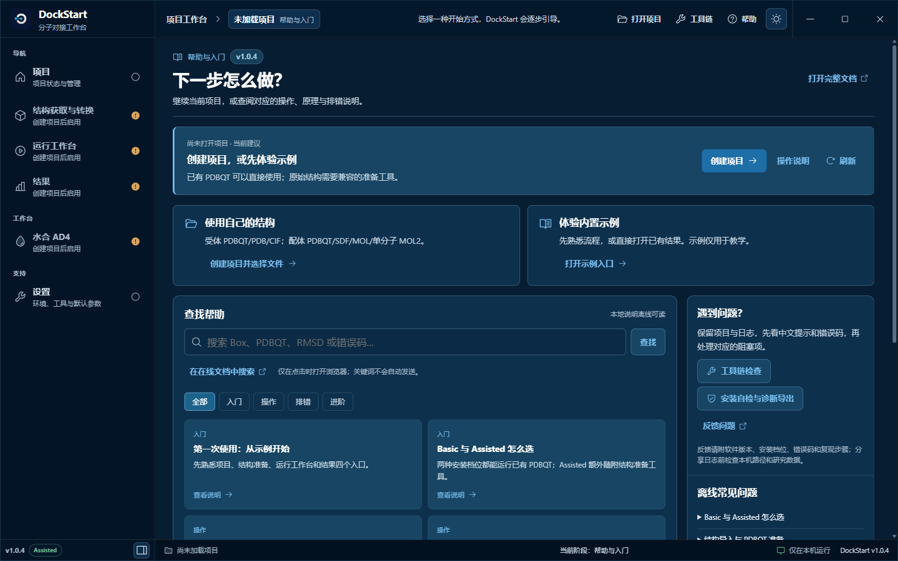
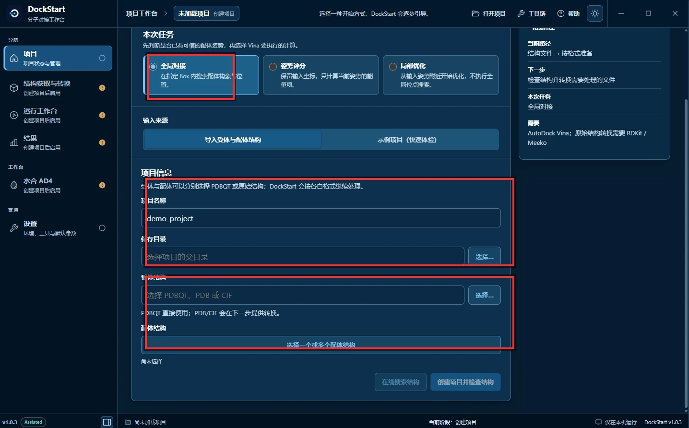
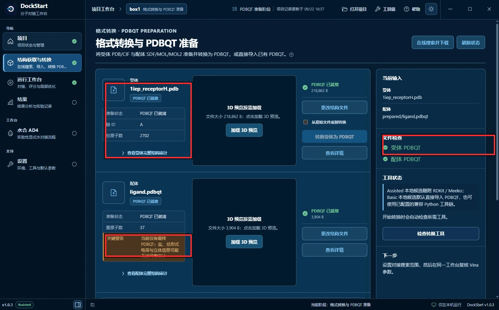
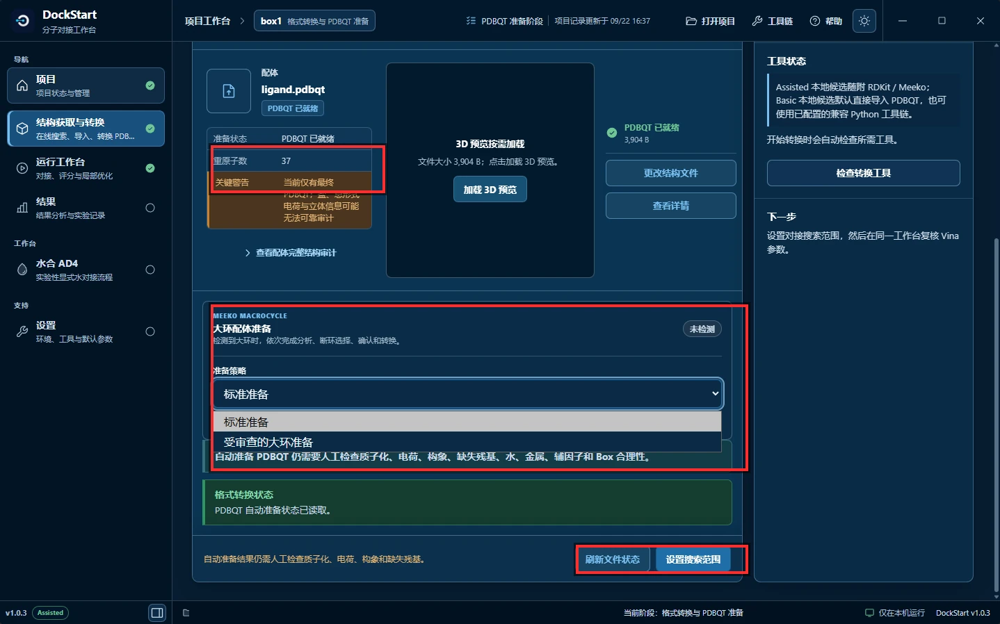
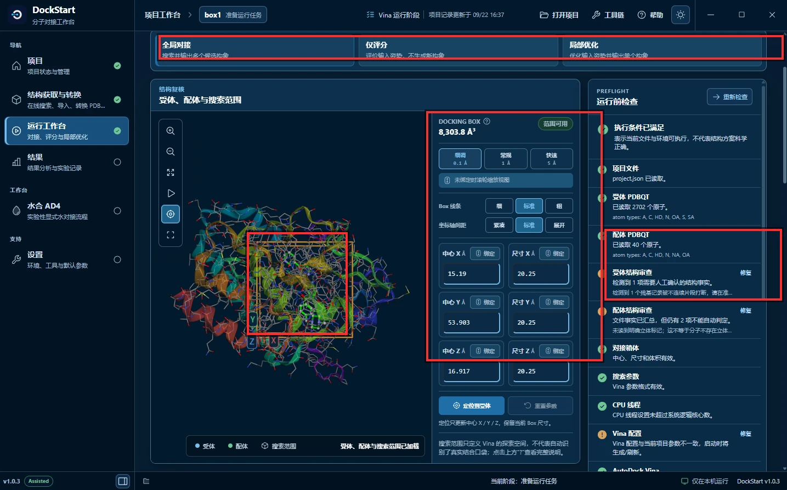
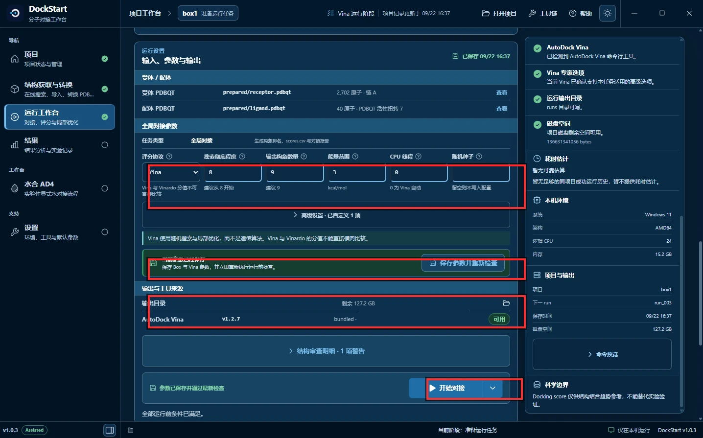
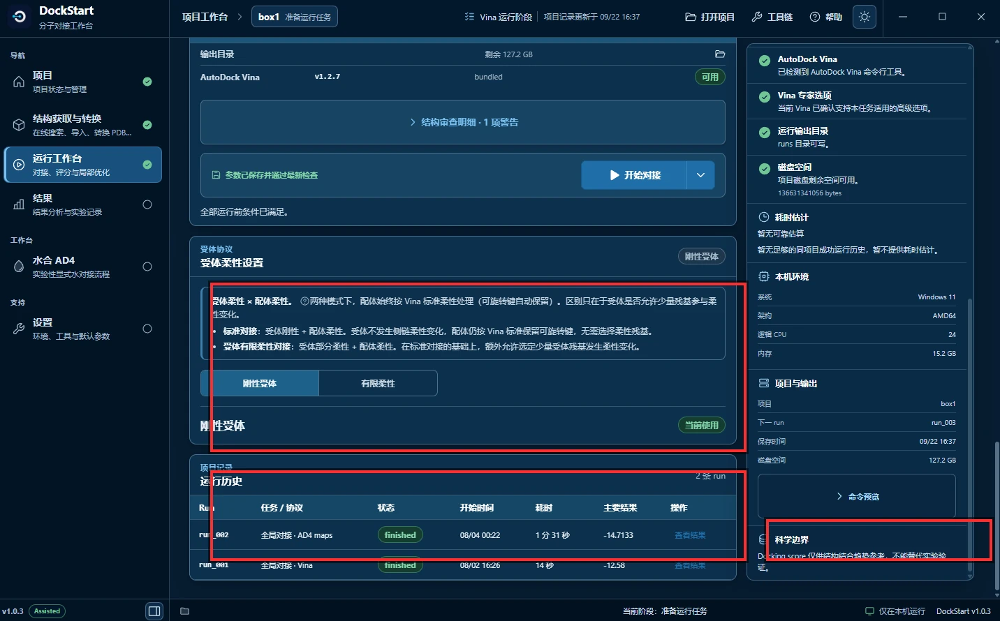
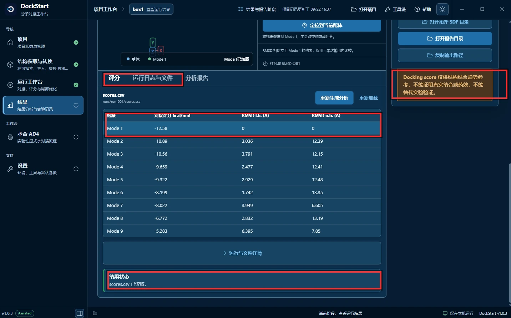
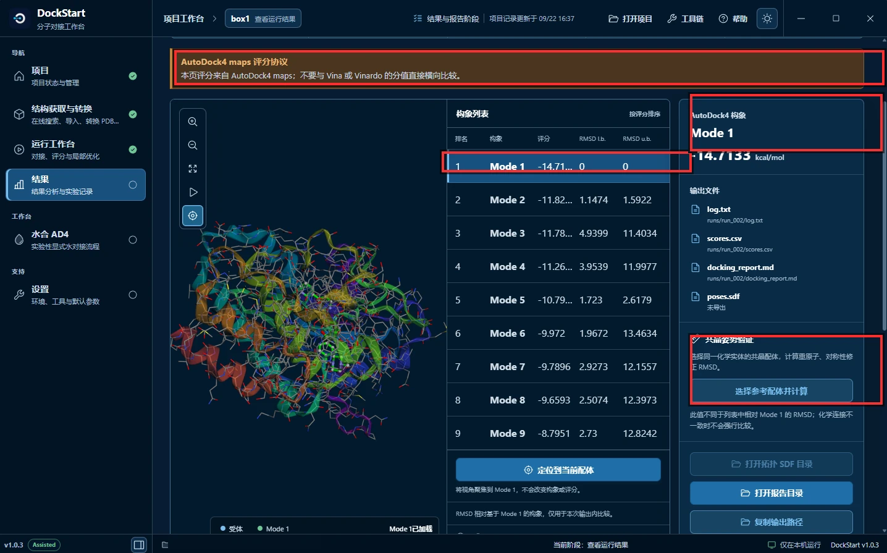
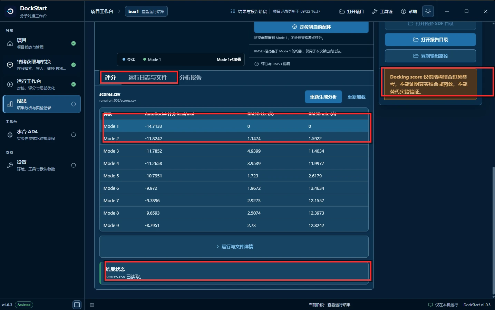

import OfficialExampleFiles from '@site/src/components/OfficialExampleFiles';

# Basic Docking — 1IEP

这是 AutoDock Vina 官方教程的第一个案例：把抗癌药伊马替尼（imatinib）对接到 c-Abl 激酶的活性位点上。下面用 DockStart 界面截图，把「建项目 → 准备结构 → 画搜索框 → 填参数 → 运行 → 看结果」完整走一遍，并把本次 Vina 结果与官方期望值逐项对照。

> **版本说明**：本页历史运行、分数及图 2 起的操作截图来自 v1.0.3；可用于理解 v1.0.4 的基础流程，但不是 v1.0.4 安装包新一轮验收。图 1 更新为真实 v1.0.4 帮助入口。首次安装请先看 [v1.0.4 下载与快速开始](../../part-c/quick-start-v1-0-4.md)。

## 官方三维结构文件 {#official-structure-files}

<OfficialExampleFiles example="basic"/>

---

## 先认识这个案例

| 项目 | 内容 |
| --- | --- |
| 受体 | c-Abl 激酶结构域，PDB 编号 [1IEP](https://www.rcsb.org/structure/1IEP) |
| 配体 | 伊马替尼（imatinib / Gleevec），从 1IEP 晶体结构中提取 |
| 搜索框中心 | `15.190, 53.903, 16.917` |
| 搜索框尺寸 | 官方教程用 `20 × 20 × 20 Å` |
| 官方 Vina 期望值 | 最佳构象约 **-13.23 kcal/mol** |
| 官方 AutoDock4 期望值 | 最佳构象约 **-14.72 kcal/mol** |

以上数值均来自 [AutoDock Vina 官方 Basic docking 教程](https://github.com/ccsb-scripps/AutoDock-Vina/blob/develop/docs/source/docking_basic.rst)。

> 官方教程特意加了一句警告：**AutoDock 力场和 Vina 力场给出的分数不能互相比较。** 记住这句话，看结果时用得上。

---

## 整条流程长什么样？

```text
第 1 步  首页 → 点左侧导航「项目」
第 2 步  新建项目：任务类型 / 名称 / 保存目录 / 受体 / 配体
第 3 步  确认 PDBQT 准备结果（重点看橙色「关键警告」）
第 4 步  大环配体准备策略 → 点「设置搜索范围」
第 5 步  设定 Grid Box（搜索范围）
第 6 步  填写 Vina 参数
第 7 步  选择对接方式（受体柔性）
第 8 步  看结果：Vina 的构象列表    （run_001）
第 9 步  看结果：Vina 的评分表      （run_001）
补充     同一项目里的 AutoDock4 maps 运行（run_002）
```

整条流程对应的导航是固定的四站：

```text
项目  →  结构获取与转换  →  运行工作台  →  结果
建项目     准备 PDBQT       设 Box 与参数    读结果
```

---

## 第 1 步：从帮助页进入「项目」



**图 1**　v1.0.4 Assisted 的实际帮助页，使用隔离设置打开；没有加载或运行本页的 1IEP 项目。

使用自己的结构时，点击左侧「项目」开始创建；需要先熟悉操作时，点击「打开示例入口」。内置小型示例只演示操作，不用于科研结论。

v1.0.4 的帮助建议随项目与工具链状态变化。问号可打开离线说明；在线文档入口需要联网。接下来图 2 起保留历史 v1.0.3 截图，按钮布局如有差异，以当前界面和帮助为准。

---

## 第 2 步：新建项目，选好三个东西



**图 2**　创建项目页。

红框圈出的三处，正好是要你做的三个决定：

**① 任务类型 —— 本案例选「全局对接」。**

三个卡片是三种计算任务，官方教程里的 Basic docking 对应第一个：

```text
全局对接    在指定 Box 内搜索配体构象与位置    ← 本案例
姿势评分    输入姿势不变，只计算当前姿势的分数
局部优化    从输入姿势附近开始优化，不做全局搜索
```

**② 项目名称 + 保存目录。**

图里项目名填的是 `demo_project`，保存目录留空。**保存目录建议放在独立、可写且空间充足的目录**，因为后续的 maps 文件可能很大（本案例的 `.map` 文件就有几十 MB）。界面右下角会显示输出目录剩余空间。

**③ 受体结构 + 配体结构。**

```text
受体结构   1iep_receptorH.pdb      （PDB / PDBQT / CIF 都可以）
配体结构   官方 1iep_ligand.sdf 或准备后的配体 PDBQT
```

两者可以分别给 PDBQT 或原始结构，DockStart 会按各自格式继续处理。**Basic 随包工具用于已有 PDBQT；Assisted 额外随附结构准备工具，可以尝试把原始结构转成 PDBQT。** 格式支持按角色区分：受体 PDB/CIF，配体 SDF/MOL/单分子 MOL2；配体 PDB 不参与 v1.0.4 内置转换，需要在外部准备。注意受体文件名里的 `H` 表示**已经加好氢**——官方教程用的正是这个文件。

---

## 第 3 步：确认 PDBQT 准备结果



**图 3**　格式转换与 PDBQT 准备。

红框圈出的三处：

**① 受体准备状态。** 卡片上写着 `PDBQT 已就绪`，大小 218,862 B，**链 ID `A`**，**总原子数 2,702**。链 ID 很重要：后面设柔性残基时要写成 `A:315` 这种形式。

**② 配体的橙色「关键警告」。**

```text
当前仅有重原子 PDBQT；
盐、总形式电荷与立体信息可能无法可靠审计
```

**这是警告，不是报错。** 文件能用，但它提醒你两件事：原始文件里没有完整记录质子化状态和立体化学信息。这也正是官方教程反复强调"不要用 PDB 格式准备小分子"的原因——PDB 格式不带键连接信息。

**③ 右侧「文件检查」。** 两项都是绿色的 ✓：

```text
受体 PDBQT   ✓
配体 PDBQT   ✓
```

**只有这两项都亮起，才说明输入文件齐了。** 这是进入下一步的通行证。

卡片下方还有一条 `查看配体完整结构审查`，点开就是这条警告的完整清单。

---

## 第 4 步：大环准备策略 → 设置搜索范围



**图 4**　同一页的下半部分。

红框圈出的三处：

**① 仍然是配体的「关键警告」**（滚动后依然置顶显示，提醒它一直有效）。

**② 大环配体准备。**

```text
准备策略   标准准备  ← 本案例选这个
           受审查的大环准备
```

界面已标注 `未检测`——伊马替尼**不是大环分子**，所以这里保持「标准准备」即可。只有当配体确实含大环骨架（比如大环肽、大环激酶抑制剂）时，才需要选「受审查的大环准备」，那条路径会检查子化、电荷、构象、缺失残基、水、金属、辅因子和 Box 合理性。

**③ 底部「设置搜索范围」按钮** —— 点它进入第 5 步。

按钮左边还有一句提示：`自动准备结果仍需人工检查质子化、电荷、构象和缺失残基。` **自动准备只保证"文件生成了"，不保证"科学上正确"。**

---

## 第 5 步：设定 Grid Box（搜索范围）



**图 5**　运行工作台 → 准备运行任务（Vina 运行阶段）。

红框圈出的四处：

**① 顶部任务类型** —— 再次确认是「全局对接」（另外两个是「仅评分」「局部优化」）。

**② DOCKING BOX 体积与「范围可用」。** 体积 `8,303.8 ų`，绿色标签 `范围可用`。

**③ 中心与尺寸六个数值** —— 这是整页最关键的数字：

```text
中心 X  15.19        尺寸 X  20.25
中心 Y  53.903       尺寸 Y  20.25
中心 Z  16.917       尺寸 Z  20.25
```

对照官方教程的 Box 设置：

```text
center_x = 15.190     size_x = 20.0
center_y = 53.903     size_y = 20.0
center_z = 16.917     size_z = 20.0
```

**中心三个值和官方完全一致**；尺寸这里是 `20.25`，比官方的 `20.0` 略大一点（20.25³ = 8,303.8，和显示的体积对得上）。

关于这 0.25 Å：

```text
本次截图用的是 20.25 × 20.25 × 20.25 Å
官方教程用的是 20 × 20 × 20 Å
想严格复现官方示例 → 把三个尺寸都改成 20
```

**不要把截图里的 20.25 当成官方原值。** 它只是本次运行的取值，差异不大（每个方向 1.25%），但复现时值得对齐。

**④ 3D 预览里的橙色搜索框** —— 这个橙色长方体就是 Vina 真正会去搜索的空间。下面那行字很关键：

> `搜索范围只定义 Vina 的搜索空间，不代表自动识别了真实结合口袋`

**搜索框是你自己画的，不是软件猜的。** 画错位置，后面所有结果都没有意义。

右侧「运行前检查」里有两项标着**维修**标签，需要你停下来读一读：

```text
受体结构审查   检测到 1 项需要人工确认的结构事实
               检测到 1 条记录含不完整侧链打断，请确认

配体结构审查   文件事实已汇总，但仍有 2 项不能自动判定
               无法确定键级标记，这不等同于不存在立体问题
```

以及下面这条：

```text
Vina 配置        Vina 配置与当前项目参数不一致，自动时生成新配置
```

这三条都不是致命错误，程序会照常运行。但它们意味着**这次运行建立在若干未经人工确认的假设之上**——写论文时必须知道这一点。

---

## 第 6 步：填写 Vina 参数



**图 6**　运行设置 → 输入、参数与输出。

红框圈出的四处：

**① 六个对接参数** —— 这一行决定了搜索的质量和成本：

| 参数 | 本案例取值 | 说明 |
| --- | --- | --- |
| 评分函数 | `Vina` | 另外可选 Vinardo、AutoDock4 |
| 搜索彻底程度 | `8` | 即 exhaustiveness，Vina 默认值 |
| 输出构象数量 | `9` | 最多保留几个 pose |
| 能量范围 | `3` | 只保留比最优构象差 3 kcal/mol 以内的 |
| CPU 线程 | `0` | 0 = 由 Vina 自动决定 |
| 随机种子 | 留空 | 留空即不固定，不可复现 |

**这里有一个值得注意的取舍。** 官方教程对这个案例的原话是：

> The imatinib ligand used in this protocol is challenging, and Vina will occasionally not find the correct pose with the default parameters.

伊马替尼这个配体比较难，**官方建议把 exhaustiveness 从默认的 8 提高到 32**。图中用的是默认值 8——这直接解释了第 8、9 步里为什么 Vina 的分数比官方期望值低一些。

**② 绿色条「当前参数已保存」** —— 参数改动后必须保存并重新检查，右侧检查项才会刷新。

**③ 输出目录与工具来源。**

```text
输出目录       （截图中的本机路径已打码）          剩余 127.2 GB
AutoDock Vina  v1.2.7   bundled（随 DockStart 自带）   可用
```

留意两件事：输出目录要留足空间（AD4 的 maps 很占地方）；`可用` 说明 DockStart 自带了一份 Vina，不需要你自己装。

**④ 右下角「开始对接」按钮** —— 点下去之前，右侧那 8 项检查应该都是通过的。

---

## 第 7 步：选择对接方式（受体柔性）



**图 7**　受体柔性设置与运行历史。

红框圈出的三处：

**① 受体柔性设置** —— 两个选项，本案例用第一个：

```text
刚性受体 + 配体柔性   受体不动，配体在 Box 内自由搜索     ← 本案例，标签「当前使用」
受体有限柔性          指定若干残基的侧链也可以动
```

**这就是"Basic docking"里的"Basic"** ——受体保持刚性。官方教程的这个案例用的就是刚性受体。只有当你明确知道某个残基侧链会挡住配体时，才去选「受体有限柔性」（官方那边的对应做法是把 `-f A:315` 这样的柔性残基交给 Vina）。

**② 项目记录 → 运行历史** —— 每次运行都有记录：

| Run | 任务·协议 | 状态 | 开始时间 | 耗时 | 主要结果 |
| --- | --- | --- | --- | --- | --- |
| `run_002` | 全局对接 · AD4 maps | finished | 08/04 00:22 | 1 分 31 秒 | -14.7133 |
| `run_001` | 全局对接 · Vina | finished | 08/02 16:26 | 14 秒 | **-12.58** |

**这张表就是可复现性的载体。** 注意两次运行耗时差了 6 倍——AD4 要先算 maps，慢是正常的。

**下面第 8、9 步看的，是 `run_001`（Vina）的结果** —— 点它右侧的「查看结果」。

**③ 右侧「科学边界」** —— 每次运行都在提醒：

> `Docking score 仅供结构结合趋势参考，不能替代实验验证。`

---

## 第 8 步：看结果——Vina 的构象列表（run_001）


**图 8**　结果 → 查看运行结果，`run_001`（**Vina**）。

红框圈出的四处：

**① 顶部运行信息条 —— 先确认你看的是哪一次运行。**

```text
运行标识   run_001
状态       已完成
任务类型   全局对接
运行耗时   14 秒
保存时间   08/02 16:26
```

**`run_001` = Vina 力场。** 这一条必须先看，否则很容易把另一次运行（`run_002`，AutoDock4 maps）的分数当成 Vina 的结果。图 7 的运行历史里可以对照。

**② 构象列表** —— 9 个 pose 按分数从好到差排列，`Mode 1` 高亮：

```text
Mode 1   -12.58       RMSD l.b. 0        RMSD u.b. 0
Mode 2   -10.89       3.036             12.39
Mode 3   -10.56       3.791             12.15
Mode 4   -9.659       2.477             12.41
Mode 5   -9.322       2.929             12.48
Mode 6   -8.199       1.742             13.35
Mode 7   -8.022       3.949             6.605
Mode 8   -6.772       2.832             13.19
Mode 9   -5.283       6.395             7.85
```

`Mode 1` 是模型认为最好的那个（**-12.58 kcal/mol**）。它的两个 RMSD 都是 0，因为它就是参照自己。

**③ 右侧所选构象分值与输出文件。**

```text
所选构象   Mode 1   -12.58 kcal/mol

输出文件   log.txt              runs/run_001/log.txt
           scores.csv           runs/run_001/scores.csv
           docking.report.md    runs/run_001/docking.report.md
           poses.sdf            runs/run_001/exports/sdf/001/poses.sdf
```

这次四个文件**都在**——`poses.sdf` 已经导出，可以直接拿去 PyMOL 等软件看构象。**不要直接把 PDBQT 交给只认识标准格式的工具**，PDBQT 不完全记录键级信息，其他工具只能靠猜，所以要用导出好的 SDF。

**④ 共晶姿势验证** —— 点「选择参考配体并计算」，可以拿晶体结构里的真实配体位置来比对预测姿势。这是判断"对接得对不对"最直接的手段。旁边的说明值得读一遍：

> `此值不同于列表中相对 Mode 1 的 RMSD；化学连接不一致时不会强行比较。`

注意截图最顶部还能看到一条橙色横幅的下缘，它写的是 **Vina、Vinardo 与 AutoDock4 的分值不可直接横向比较**——后面会详细讲这件事。

---

## 第 9 步：看结果——Vina 的评分表（run_001）



**图 9**　同一页的「评分」（`scores.csv`）标签页。

红框圈出的四处：

**① 三个标签** —— 评分 / 运行日志与文件 / 分析报告。数值看「评分」，原始记录看「运行日志与文件」。

**② 表头与 Mode 1 行** —— 这张表就是 `runs/run_001/scores.csv` 的内容。注意表头写的是「**对接评分**」而不是「AutoDock4 评分」，因为这是 Vina 的力场：

| 构象 | 对接评分 kcal/mol | RMSD l.b. (Å) | RMSD u.b. (Å) |
| --- | --- | --- | --- |
| Mode 1 | -12.58 | 0 | 0 |
| Mode 2 | -10.89 | 3.036 | 12.39 |
| Mode 3 | -10.56 | 3.791 | 12.15 |
| Mode 4 | -9.659 | 2.477 | 12.41 |
| Mode 5 | -9.322 | 2.929 | 12.48 |
| Mode 6 | -8.199 | 1.742 | 13.35 |
| Mode 7 | -8.022 | 3.949 | 6.605 |
| Mode 8 | -6.772 | 2.832 | 13.19 |
| Mode 9 | -5.283 | 6.395 | 7.85 |

`l.b.` = lower bound（下界），`u.b.` = upper bound（上界）。两列都是相对本次最佳 Mode 1 的可移动重原子坐标差异，**不做额外叠合**。u.b. 按原子身份逐个对应，忽略对称性；l.b. 采用最近同元素原子匹配，取两个方向结果的较大值。它们不是与实验共晶结构比较的验证 RMSD。详见 [RMSD 专题](../../part-a/understanding-results/rmsd.md) 和 [Vina 官方输出说明](https://vina.scripps.edu/manual/#output)。

**③ 结果状态** —— `scores.csv 已读取`，说明这份表格是从实际输出文件读出来的，不是界面缓存。

**评分行数与保存构象数量需要分别检查。** Vina 1.2.7 的日志可能打印比输出文件更多的候选评分；写入 `out.pdbqt` 时还会按 `energy_range` 过滤。这里的 9 行评分不能单独证明文件保存了 9 个构象，真正可查看的结构以输出文件中的 `MODEL` 为准。本文保留历史评分，不据此推定历史输出文件数量。参见 [Energy Range](../../part-a/search-and-parameters/energy-range.md)。

**④ 科学边界** —— 再次强调：

> `Docking score 仅供结构结合趋势参考，不能证明真实结合或药效，不能替代实验验证。`

---

## 补充：同一项目里的 AutoDock4 maps 运行（run_002）

上面第 8、9 步展示的是 **Vina** 的结果。这个项目里还跑过一次 **AutoDock4 maps**（`run_002`），截图保留在这里作为对照。

**先记住一句话：这是另一次运行、另一套评分函数，分数不能和上面 Vina 的横向比较。**

> **AutoDock4 maps 的完整操作流程在[I 节：AutoDock4 Maps Workflow](./autodock4-maps-workflow.md)。**
> 本节只讲"同一项目里两套结果并存"这件事，不讲流程。
>
> 另外：本文档编写后期，这个项目里又增加了一次用官方搜索强度重跑的 AD4 运行
> （`run_003`，`exhaustiveness 32`，Mode 1 = `-14.7279`）——那是 I 节的数据。
> **本节图表对应的仍然是更早的 `run_002`。**



**图 10**　`run_002`（AutoDock4 maps）的构象列表。

最上方那条橙色横幅是这一页最重要的信息：

```text
AutoDock4 maps 评分协议
本页评分来自 AutoDock4 maps；不要与 Vina 或 Vinardo 的分值直接横向比较。
```

`Mode 1` 为 **-14.7133 kcal/mol**，同时 `poses.sdf` 这次显示**未导出**。



**图 11**　`run_002` 的评分表。注意表头是「**AutoDock4 评分** kcal/mol」，与图 9 的「对接评分」不同——这正是判断"这一页是哪套力场"的最快方法。

| 构象 | AutoDock4 评分 kcal/mol | RMSD l.b. (Å) | RMSD u.b. (Å) |
| --- | --- | --- | --- |
| Mode 1 | -14.7133 | 0 | 0 |
| Mode 2 | -11.8242 | 1.1474 | 1.5922 |
| Mode 3 | -11.7852 | 4.9399 | 11.4034 |
| Mode 4 | -11.2658 | 3.9539 | 11.9977 |
| Mode 5 | -10.7951 | 1.723 | 2.6179 |
| Mode 6 | -9.972 | 1.9672 | 13.4634 |
| Mode 7 | -9.7896 | 2.9273 | 12.1557 |
| Mode 8 | -9.6593 | 2.5074 | 12.3973 |
| Mode 9 | -8.7951 | 2.73 | 12.8242 |

两次运行放在一起看：

| | `run_001` | `run_002` |
| --- | --- | --- |
| 评分函数 | Vina | AutoDock4 maps |
| 是否需要先算 maps | 不需要 | 需要 |
| 耗时 | 14 秒 | 1 分 31 秒 |
| Mode 1 分数 | **-12.58** | **-14.7133** |
| 表头用词 | 对接评分 | AutoDock4 评分 |
| poses.sdf | 已导出 | 未导出 |

**-14.7133 比 -12.58 "更好看"，但这不代表 AD4 比 Vina 更强。** 两套力场的能量项定义不同，数值不可比——这就是官方教程那句警告的含义。

---

## 结果合理吗？和官方期望值对照

把项目里的几次运行和官方教程的期望值放在一起：

| 运行 | 力场 | 本次最佳构象 | 官方期望值 | 搜索彻底程度 |
| --- | --- | --- | --- | --- |
| `run_001` | Vina | **-12.58** | 约 **-13.23** | 8（官方建议 32） |
| `run_002` | AutoDock4 maps | **-14.7133** | 约 **-14.72** | 8 |
| `run_003` | AutoDock4 maps | **-14.7279** | 约 **-14.72** | 32（I 节的数据） |

**结论：几次运行都落在合理范围内。**

AutoDock4 那次几乎和官方完全一致（-14.7133 对 -14.72，差 0.007 kcal/mol）。

Vina 那次比官方低了约 0.65 kcal/mol，原因很明确——官方教程对这个案例的解释是：

> With `exhaustiveness` set to `32`, Vina will most often give a single docked pose with this energy. With the lower default exhaustiveness, several poses flipped end to end, with less favorable energy, may be reported.

**用默认的 8 而不是 32，就可能报出能量较差、首尾翻转的构象。** 这不是软件出错，而是搜索投入不足的预期结果。

逐条对比会更直观——注意后半段（Mode 6 以后）差距明显变大，Mode 9 差了 3.5 kcal/mol：

| 构象 | 本次 Vina | 官方 Vina | 差值 |
| --- | --- | --- | --- |
| Mode 1 | -12.58 | -13.23 | +0.65 |
| Mode 2 | -10.89 | -11.29 | +0.40 |
| Mode 3 | -10.56 | -11.28 | +0.72 |
| Mode 4 | -9.659 | -11.15 | +1.49 |
| Mode 5 | -9.322 | -9.746 | +0.42 |
| Mode 6 | -8.199 | -9.132 | +0.93 |
| Mode 7 | -8.022 | -9.079 | +1.06 |
| Mode 8 | -6.772 | -8.931 | +2.16 |
| Mode 9 | -5.283 | -8.762 | +3.48 |

想让 Vina 复现官方数值，把第 6 步的「搜索彻底程度」改成 `32`、Box 尺寸改成 `20` 再跑一次即可。

---

## 截图里出现过的四种提示，分别怎么读

| 提示 | 颜色 | 含义 | 怎么办 |
| --- | --- | --- | --- |
| `当前仅有重原子 PDBQT；盐、总形式电荷与立体信息可能无法可靠审计` | 橙 | 输入文件缺少质子化/立体化学的完整记录 | 知道即可；要严谨就回到原始结构确认质子化状态 |
| `检测到 1 条记录含不完整侧链打断，请确认` | 黄（维修） | 受体有残基侧链不完整或缺原子 | 确认是否落在结合位点附近；在附近就要修结构 |
| `Vina 配置与当前项目参数不一致，自动时生成新配置` | 黄（维修） | 旧的配置文件与当前参数对不上 | 让软件重新生成，或手动同步参数后再跑 |
| `本页评分来自 AutoDock4 maps；不要与 Vina 或 Vinardo 的分值直接横向比较` | 橙（横幅） | 两套力场分数不同源 | 只在同一力场内比较 |

共同点：**这些都不是"报错"，程序会继续跑。** 但它们决定了结果的可靠性边界，读一遍再决定要不要动手。

---

## 关于本篇截图

这部分说明截图本身的来源，便于你判断哪些地方与自己的复现流程不同。

**① 图 1、图 2 与图 3 之后不是同一个项目。**

```text
图 1、图 2      新建项目时的界面（项目名填的是 demo_project）
图 3 – 图 11    一个已建好的参考项目（项目名 box1）的后续页面
                输入文件与官方教程一致：1iep_receptorH.pdb + ligand.pdbqt
```

也就是说，**图 2 是"新建项目"的表单，图 3 起是打开一个已有项目。** 操作流程的顺序是对的，但项目名不一致，不应把它们理解成同一次、同一个项目的连续截图。

**② 结果部分是两个不同的运行，别混在一起看。**

```text
图 8、图 9      run_001 = Vina          ← 与第 6 步的 Vina 参数直接对应
图 10、图 11    run_002 = AutoDock4 maps ← 另一套 scoring，另一条运行记录
```

想让结果页显示某一次运行，就在第 7 步的运行历史里找到对应的 `run_XXX`，点它右侧的「查看结果」。

**③ 截图中的本机路径已做打码处理。** 图 3 – 图 11 底部状态栏的本机项目路径，以及图 6、图 7 中「输出目录」和 DockStart 自带 Vina 的安装路径，都已被遮盖——公开文档不保留本机目录信息。**你自己的目录不必和它一样**，任何路径都可以，只要目录可写、空间足够。

**④ 图 8 顶部略被裁切。** 该截图顶端截断了一条橙色横幅的上半部分，只能看到下缘文字，内容与图 10 的横幅相同（Vina / Vinardo / AutoDock4 分值不可直接横向比较）。

**⑤ Box 尺寸是本次运行的取值。** 图 5 显示 `20.25 × 20.25 × 20.25 Å`，官方教程用 `20 × 20 × 20 Å`，两者中心坐标一致。这是本次运行的参数，不是官方原值。

---

## 总结

按项目、结构准备、Box、参数、运行和结果检查这条顺序，可以完成 1IEP 基础案例。本次 Vina Mode 1 为 `-12.58`，官方参考约 `-13.23`，并非数值完全复现。对照结果时，连同输入结构与搜索设置一起核对；AD4 的独立流程见 I 节。

---

<details className="guide-references">
<summary id="参考资料">参考资料</summary>

1. AutoDock Vina 官方 Basic docking 教程（1IEP / imatinib、Box 设置、ad4 与 vina 两套期望结果，以及 exhaustiveness 的说明）。
2. RCSB PDB 条目 [1IEP](https://www.rcsb.org/structure/1IEP)（c-Abl 激酶结构域与伊马替尼复合物）。
3. 官方教程 *4.a Using AutoDock4 forcefield* 与 *4.b Using Vina forcefield*（两套力场分数不可比较的原始说明）。
4. 官方教程 *5. Expected results*（`-14.72` 与 `-13.23` 两个期望值及完整输出表）。
5. DockStart 界面：运行工作台的运行前检查、结果页的评分协议横幅与运行信息条（截图来源）。

</details>

## 继续阅读

- 搜索范围的设定：[Box 与 Maps FAQ](../../part-c/faq-box-and-maps.md)
- 搜索彻底程度的影响：[Exhaustiveness](../../part-a/search-and-parameters/exhaustiveness.md)
- 结果怎么读：[如何正确解读结果](../../part-c/interpreting-results.md)
- 两次结果为什么不一样：[为什么结果不一致](../../part-c/why-results-differ.md)
- 同一条流程的 AD4 maps 分支：[AutoDock4 Maps 工作流](./autodock4-maps-workflow.md)
