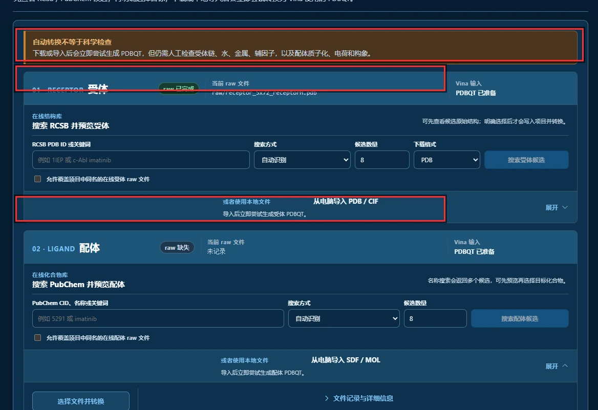
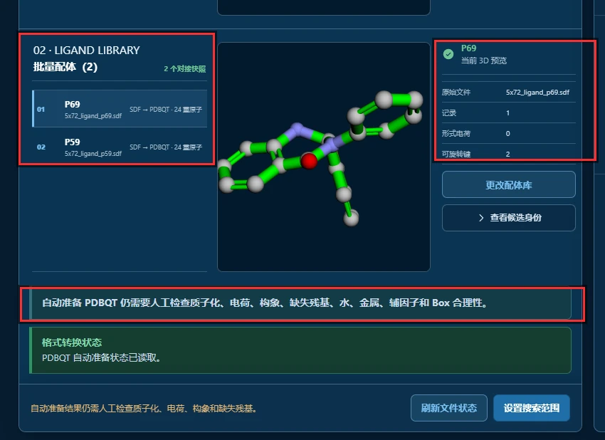
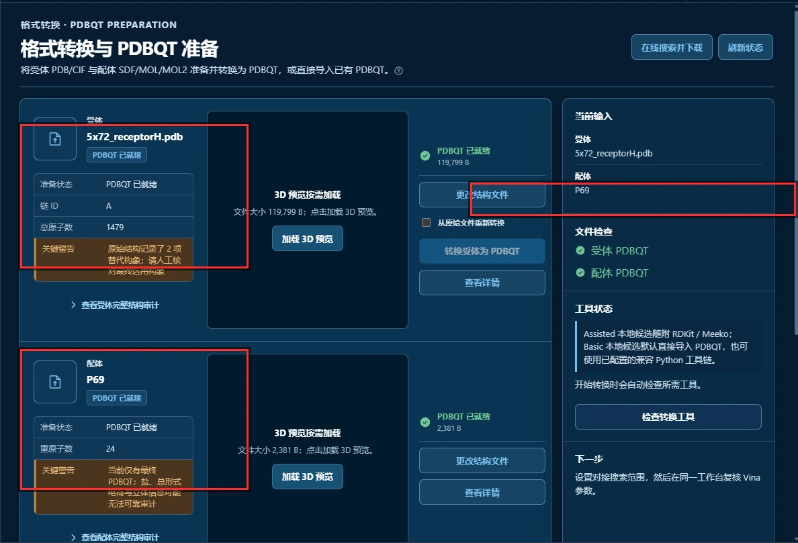
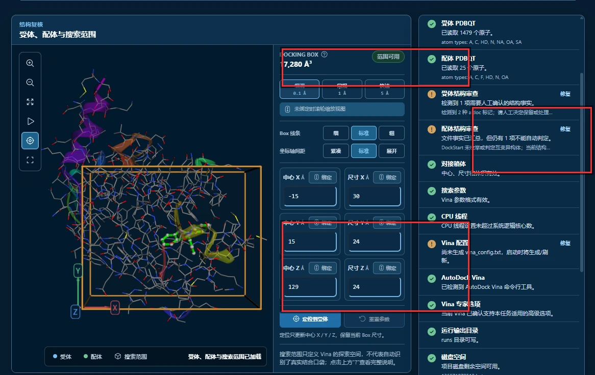
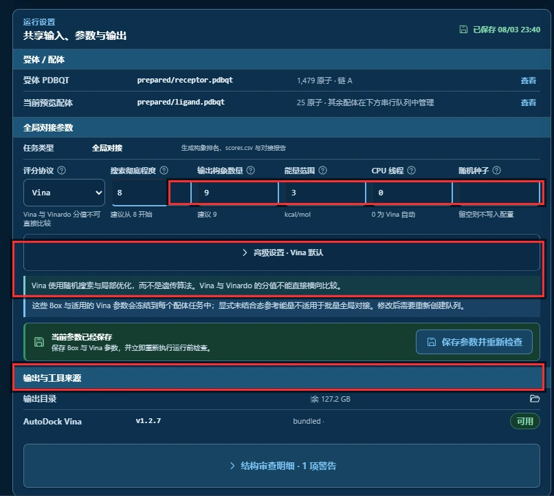
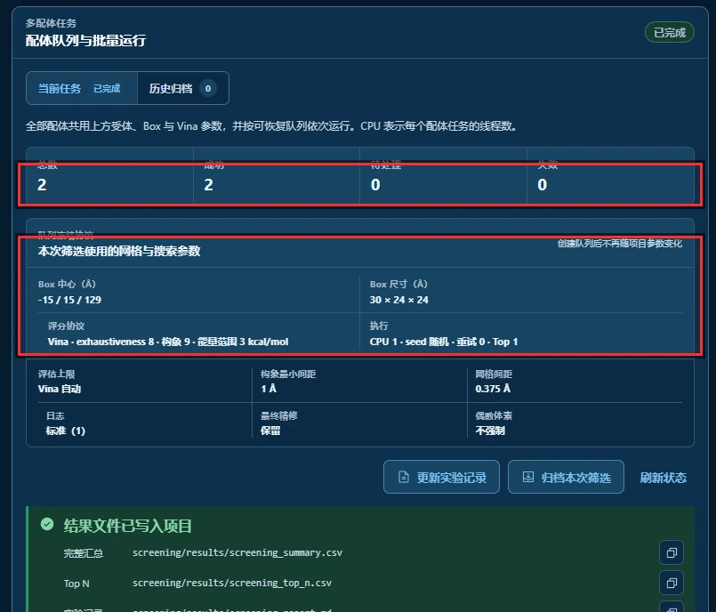
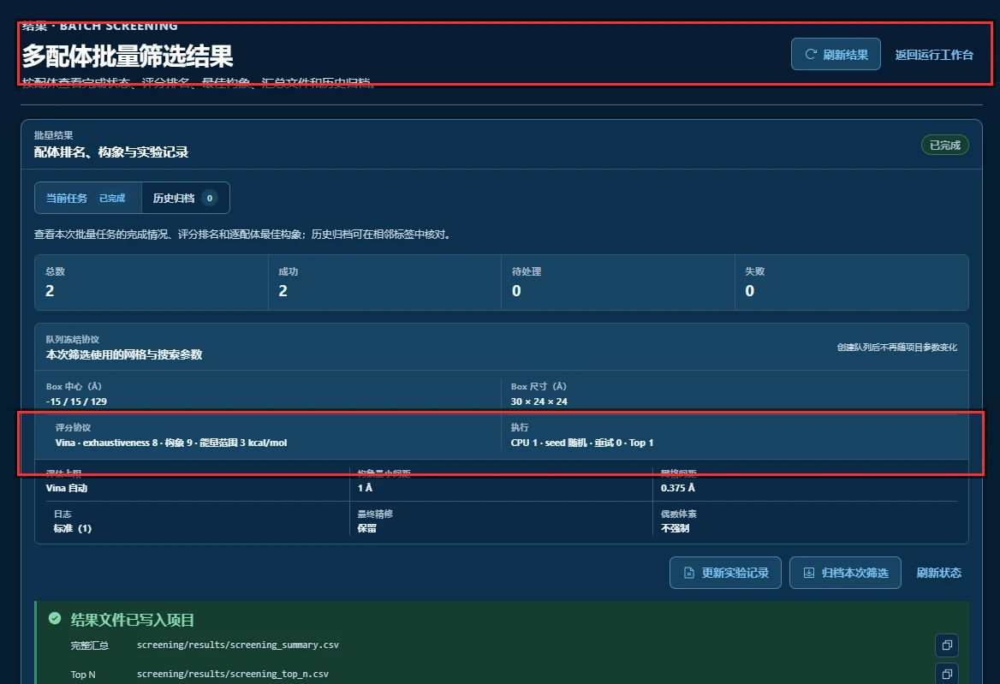
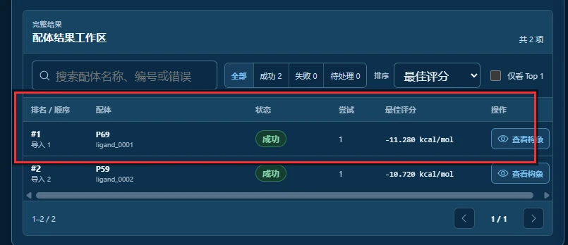

import OfficialExampleFiles from '@site/src/components/OfficialExampleFiles';

# Batch Docking

批量对接使用同一受体、Box 和参数，逐个运行配体并汇总各自的最佳评分。跟做这个案例时，可以同时检查队列是否冻结了预期条件，以及每个配体的结构准备是否合理。

## 官方三维结构文件 {#official-structure-files}

<OfficialExampleFiles example="batch"/>

---

## 先认识这个案例：批量 ≠ 共同对接

DockStart 里有两个带“多配体”字样的入口，先区分它们各自怎样运行和计分。

```text
串行批量筛选          N 个配体，一个一个依次跑      每个配体各自出一个分数
多配体共同对接（实验性） 2 个配体，在同一次搜索里一起跑  只出一个联合分数
                     ↑ 这是 E 节的内容
```

| | 串行批量筛选（本节） | 多配体共同对接（E 节） |
| --- | --- | --- |
| 配体数量 | 一批（上限 500 个） | **固定 2 个** |
| 运行方式 | 依次、可恢复的队列 | 同一次全局搜索 |
| 结果 | **每个配体一个最佳评分 + 排名** | **整个联合体系一个评分** |
| 能否看出单个配体的贡献 | 能 | **不能** |
| 典型用途 | 虚拟筛选、同系列化合物排序 | 片段共同占据同一口袋 |

**判据很简单：结果页有几个分数。** 本节的结果页有两行（P69 一行、P59 一行），那就是批量；E 节的结果页只有一个"最佳联合评分"和"成员数 2"。

本节用的数据来自一个真实的批量项目：

| 项目 | 内容 |
| --- | --- |
| 受体 | PDE（磷酸二酯酶），PDB 编号 [5X72](https://www.rcsb.org/structure/5X72) |
| 配体库 | 5X72 晶体结构里的两个抑制剂 **P59** 与 **P69** |
| 搜索框中心 | `-15, 15, 129` |
| 搜索框尺寸 | `30 × 24 × 24 Å`（体积 17,280 ų） |
| 配体数 | 2 |
| 结果 | P69 **-11.280** ／ P59 **-10.720** |
| 总耗时 | 27 秒（每个配体 13 秒） |

> 这两个配体其实是**立体异构体**，而且它们是官方的「多配体共同对接」示例里的那一对。
> 也就是说：**本节和 E 节用的是完全相同的受体与配体，唯一的区别就是"分别跑"还是"一起跑"。**
> 这组对照会在 E 节展开。

---

## 官方有对应教程，但没有示例数据

**官方教程里确实有这一课**，叫 `docking_in_batch`。它给的用法是：

```bash
vina --receptor 1iep_receptor.pdbqt \
     --batch ligands/1iep_ligand_1.pdbqt \
     --batch ligands/1iep_ligand_2.pdbqt \
     --batch ligands/1iep_ligand_3.pdbqt \
     --config config.txt --dir poses
```

```text
--batch     指定一个配体，可以重复写多次（也支持通配符）
--dir       指定输出目录，输出文件名是 <配体名>_out.pdbqt
            配体重名时会自动加序号
```

**而且官方在这节课的开头就写了这么一句：**

> **Do not confuse this with multiple ligand docking**, in which multiple ligands are docked simultaneously.

**这句话正好印证了本节开头那个区分**——官方的批量（`--batch`）和官方的多配体（`--ligand A B`）是两回事，官方自己都怕人混。

官方教程还补了一句：**"Currently, there is no option to iterate multiple receptors"**——一个受体系列、多个配体可以，反过来不行。要循环受体得自己写 shell 脚本。

### 但官方没有配套的示例数据

官方 `example/` 目录一共 8 个，其中 6 个是对接案例，**没有 batch 的示例**：

```text
basic_docking                       → B 节
flexible_docking                    → C 节
mulitple_ligands_docking            → E 节
docking_with_macrocycles            → F 节
docking_with_zinc_metalloproteins   → H 节
hydrated_docking                    → G 节
autodock_scripts                    ← 脚本示例
python_scripting                    ← 脚本示例
```

所以本节的性质与其他章不同：

```text
第一、二、四章   官方有示例数据     → 能和官方期望值逐项对照
本节            官方有教程、无示例数据 → 没有官方期望值可对照
```

**本节的"对照"因此是另外两件事：**

1. **两次运行的一致性**（同一批数据重跑，分数应该稳定）
2. **与 E 节的对照**（同一套受体配体，分别跑 vs 一起跑）

**DockStart 的批量相对官方 `--batch` 多做的，是工程层的那一层**：队列、失败重试、参数冻结、结果排名、归档导出。官方的 `--batch` 只负责"跑"，剩下的要你自己写脚本。

---

## 整条流程长什么样？

```text
第 1 步  导入受体，并把两个配体一起导入「配体库」
第 2 步  确认 PDBQT 准备结果（受体 + 配体库）
第 3 步  设定 Grid Box（-15/15/129，30×24×24）
第 4 步  确认运行参数（评分函数 Vina，搜索彻底程度 8）
第 5 步  检查配体队列与「队列冻结协议」
第 6 步  看结果：批次统计与配体排名
```

---

## 第 1 步：导入受体与配体库



**图 1**　结构获取与转换。

页面顶部有一条橙色横幅，值得先读一遍：

```text
自动转换不等于科学检查
下载或导入后会立即尝试生成 PDBQT，但仍需人工检查受体链、水、金属、辅因子，
以及配体质子化、电荷和构象。
```

红框圈出的三处里，**最容易被误读的是 ②**：

**① `01 · RECEPTOR`** —— `raw 已完成`，原始文件 `raw/receptor_5x72_receptorH.pdb`，`Vina 输入 PDBQT 已准备`。受体路径和状态都清清楚楚。

**② `02 · LIGAND`** —— 显示 **`raw 缺失`**、**当前 raw 文件「未记录」**，但右侧 `Vina 输入` 是 `PDBQT 已准备`。

**这不是出错。** 批量项目的配体不走这个"单配体槽位"，而是走**配体库**——单配体槽位自然没有 raw 记录。项目的实际记录也印证这一点：

```text
ligand.raw_file  = ""        ← 单配体槽位确实没有 raw 文件
ligand.source_id = "P69"     ← 只是把 P69 拿来当预览
```

**③ 那配体到底在哪？** 就在下面这张图里。



**图 2**　配体库：`批量配体 (2)`。

红框圈出的三处：

**① 批量配体 (2)** —— 两个成员都在：

```text
01  P69    5x72_ligand_p69.sdf    SDF → PDBQT · 24 重原子
02  P59    5x72_ligand_p59.sdf    SDF → PDBQT · 24 重原子
```

这就是批量的起点：**一个配体库，而不是一个配体。**

**② 右侧的配体身份信息** —— 以 P69 为例：

```text
原始文件    5x72_ligand_p69.sdf
记录        1
形式电荷    0
可旋转键    2
```

这几个数字不是装饰。**形式电荷和可旋转键直接决定对接结果是否可信**，而且它们是从原始 SDF 拓扑算出来的，不是你填的。

**③ 页面底部的提醒** —— 和图 1 的横幅是同一件事，但措辞更具体：

```text
自动准备 PDBQT 仍需要人工检查质子化、电荷、构象、缺失残基、水、金属、辅因子和 Box 合理性。
```

**一个配体要检查这些，一批配体就要检查 N 遍。** 这是批量相对单配体最容易被低估的成本。

> 两个配体的原始文件**都不含氢**。官方教程里这一步要用 `scrub.py` 单独加氢；
> DockStart 会在准备 PDBQT 时自动加，不需要你手工处理。

---

## 第 2 步：确认 PDBQT 准备结果



**图 3**　格式转换与 PDBQT 准备。

红框圈出的三处：

**① 受体状态。** `5x72_receptorH.pdb`，`PDBQT 已就绪`，**链 ID `A`**，**总原子数 1,479**。

下面还有一条橙色警告，**这条很关键**：

```text
原始结构记录了 3 项替代构象，请人工核对最终适用构象
```

**这就是 altloc（替代构象）。** 我去原始 PDB 里核过，精确定位到：

```text
altLoc 非空的行   34 行
不同的标记        'A' 17 次、'B' 17 次
全部来自          同一个残基 A:133
```

也就是说 **A:133 这个残基在晶体结构里有两套位置**。官方教程明确用 `--default_altloc A` 指令取 A 那一套；DockStart 没有这个开关，而是**把它作为一条需要人工判断的"维修"项报出来**——见第 3 步的运行前检查。

**② 配体状态。** `P69`，`PDBQT 已就绪`，**重原子数 24**，带同一条熟悉的橙色警告（仅有重原子 PDBQT）。

**③ 右侧「文件检查」。** 受体、配体两项都是 ✓。

> **小提醒**：这里只显示 `P69`，因为这是"当前预览配体"。P59 在配体库里，不在这一屏——参见图 2。

---

## 第 3 步：设定 Grid Box



**图 4**　结构复核：受体、配体与搜索范围。

红框圈出的三处：

**① DOCKING BOX 体积 `17,280 ų`，绿色标签「范围可用」。**

17,280 = 30 × 24 × 24，正好对应官方的 `--box_size 30 24 24`。

**② 中心与尺寸六个数值。**

```text
中心 X  -15          尺寸 X  30
中心 Y   15          尺寸 Y  24
中心 Z  129          尺寸 Z  24
```

注意 **X 是负数、Z 很大（129）**——这个口袋的位置和前面几章完全不同，不要凭习惯填。

> 参考量级：这个盒子共 **342,225 个格点**、6 种原子类型（A、C、F、HD、N、OA），
> 估算 affinity maps 约 **16.4 MB**。**批量的 maps 只算一次然后复用**，所以这个成本摊到每个配体上可以忽略。

**③ 运行前检查里两条「维修」。**

```text
受体结构审查   检测到 1 项需要人工确认的结构事实。
              检测到 2 种 altloc 标记；请人工决定保留或处理。

配体结构审查   文件事实已汇总，但仍有 1 项不能自动判定。
```

**第一条就是图 3 说的 A:133。** 官方的做法是命令行里一句 `--default_altloc A`；DockStart 的做法是**把决定权交给你**——它告诉你"有两种标记、需要人工决定"，但不替你做选择。

这就是本节"官方有、DockStart 没有"清单里最实质的一条：**没有 `--default_altloc` 开关，替代构象的处理需要人工确认。**

---

## 第 4 步：确认运行参数



**图 5**　共享输入、参数与输出。

红框圈出的三处：

**① 六个对接参数：**

| 参数 | 本次取值 | 说明 |
| --- | --- | --- |
| 评分函数 | `Vina` | 也可选 AutoDock4（需先算 maps） |
| 搜索彻底程度 | **`8`** | Vina 默认值 |
| 输出构象数量 | `9` | 每个配体保留的构象数 |
| 能量范围 | `3` | kcal/mol |
| CPU 线程 | `0` | 0 = 由 Vina 自动 |
| 随机种子 | 留空 | 每次随机 |

**② 「其余配体在下方串行队列中管理」** —— 这一行说明界面只预览一个配体，其余的在队列里。**批量模式下不会有"当前配体"这个概念，只有"队列"。**

**③ 参数会被冻结：**

```text
这些 Box 与适用的 Vina 参数会冻结到每个配体任务中；
显式未结合态参考能虽不适用于批量全局对接。修改后需要重新创建队列。
```

**"冻结到每个配体任务中"是批量的核心机制**——见下一步。

> **关于搜索彻底程度 8：** 本节没有官方示例，所以没有"官方要求值"这个约束。
> 但要知道：**E 节（同一套受体配体）用的是 32。** 两个案例的参数不同，所以结果的量级不能直接对照，
> 这一点在 E 节会明确写出。

---

## 第 5 步：检查配体队列与冻结协议



**图 6**　配体队列与批量运行（已完成）。

红框圈出的两处：

**① 四个计数格：**

```text
总数 2    成功 2    待处理 0    失败 0
```

**批量的第一件事是看这四个数。** 只要"失败"不是 0，后面的排名就只是"成功那部分的排名"——这一点必须写在实验记录里，否则排名会被误读。

**② 队列冻结协议。**

```text
Box 中心 (Å)     -15 / 15 / 129
Box 尺寸 (Å)     30 × 24 × 24

评分协议          Vina · exhaustiveness 8 · 构象 9 · 能量范围 3 kcal/mol
执行              CPU 1 · seed 随机 · 重试 0 · Top 1

评估上限          Vina 自动
构象最小间距      1 Å
网格间距          0.375 Å

日志              标准 (1)
最终精修          保留
保龄体系          不强制
```

右上角还有一句关键提示：

```text
创建队列后不再随项目参数变化
```

**这就是批量的可复现性机制。** 队列一旦创建，其 Box 与 Vina 参数就被**冻结**进每一条配体任务里。此后你再去改项目的参数，也不会影响这个已建成的队列——**改参数必须重新建队列**。

这个设计的意义在于：批量跑 N 个配体可能要很久，中途你很容易手滑改了参数。冻结协议保证**这 N 个结果是在同一套条件下得到的**——否则排名毫无意义。

> **参数速查（写在界面上的硬上限）**：
> 配体数上限 500、每个配体大小上限 16 MB、Box 单边上限 126 Å、
> 搜索彻底程度上限 128、输出构象数上限 50、CPU 上限 64。

---

## 第 6 步：看结果



**图 7**　结果页：多配体批量筛选结果。

红框圈出的两处：

**① 页头 `结果 · BATCH SCREENING`** —— 确认这是批量结果页，而不是单次运行的结果页。

**② 批次统计** —— 和队列面板一致：总数 2、成功 2、待处理 0、失败 0。

页面下半部分还会列出**结果文件已写入项目**：

```text
完整汇总    screening/results/screening_summary.csv
Top N       screening/results/screening_top_n.csv
实验记录    screening/results/screening_report.md
```

**注意这是"文件"，不是"界面"。** 批量结果以 CSV / Markdown 落在项目目录里，界面只是把它们读出来展示。要做进一步分析，直接拿这些文件。



**图 8**　配体排名 —— 本节的主结果。

| 排名 | 配体 | 状态 | 尝试 | 最佳评分 |
| --- | --- | --- | --- | --- |
| #1 | **P69** | 成功 | 1 | **-11.280 kcal/mol** |
| #2 | **P59** | 成功 | 1 | **-10.720 kcal/mol** |

**所有配体共用同一个受体、同一个 Box、同一套参数**——所以这两行是**可以横向比较**的（这是批量最大的价值）。P69 比 P59 低 0.56 kcal/mol。

除了排名表，项目里还会生成 SDF 导出包（本次 2 个配体、共 18 个构象），可以拿去分子查看器逐个看。

---

## 结果怎么看：批量的四条边界

**① "排名"只在这批配体内部成立。**

排序成立的前提是**条件完全一致**。所以队列冻结协议不是可选项——一旦某个配体用了不同的 Box 或参数，整个排名就作废。

**② 排名靠前 ≠ 更好的药。**

这仍然只是 docking score。界面在结果页反复提醒的那句在这里同样适用：

> Docking score 仅供结构结合趋势参考，不能证明真实结合或药效，不能替代实验验证。

**批量的排名只是"先看哪个"，不是"哪个更好"。**

**③ 失败项必须一起报告。**

如果 100 个配体里失败了 30 个，而失败的恰好是某类结构，那么"成功 70 个的排名"是有偏的。**报告"成功 70 / 失败 30"，比只报告排名更重要。**

**④ 准备质量随配体数量线性放大。**

界面那句"自动准备 PDBQT 仍需要人工检查质子化、电荷、构象"——检查一个配体是几分钟的事，检查 500 个就是几天。**批量省下的是计算，不是判断。**

---

## 与 E 节的关系（预告）

本节和 E 节用的是**完全相同的受体与配体**（5X72 的 P59 与 P69），只差运行模式：

```text
D 节  串行批量筛选       两个配体分别跑     P69 = -11.280 ／ P59 = -10.720
E 节  多配体共同对接     两个配体一起跑     官方期望约 -19.04
```

**这两个结果不能直接比较大小**，有两个原因：

```text
① 含义不同：-11.280 是"P69 单独对接"的分数；
            -19.04 是"P59 + P69 这个联合体系"的分数，不是任何一个配体的分数。
② 参数不同：本节 exhaustiveness = 8，E 节 = 32。
```

**批量的价值在于"把一批分子排出顺序"；共同对接的价值在于"看两个分子能不能同时占据一个口袋"。** 它们回答的是两个不同的问题。

---

## 关于本篇截图

**① 截图来自一个已完成的批量项目。**

```text
项目名   text3_Batch_docking（注意项目名里是 text3，不是 test3）
批次号   screening_001
创建     2026-08-03 15:40:41
完成     2026-08-03 15:41:08（总耗时 27 秒，每个配体 13 秒）
```

**本文没有重新运行任何计算**，所有数字都取自这个项目已有的记录。

**② 8 张图全是局部截图。** 它们只截取了界面上的面板，没有窗口边框与底部状态栏，所以尺寸大小不一。好处是聚焦，代价是和整窗截图并排时观感不一致。

**③ 本机路径已打码。** 图 5 中「输出目录」与 DockStart 自带 Vina 的安装路径都已被遮盖。**你自己的目录不必和它一样**，任何路径都可以，只要空间够、不含中文。

**④ 受体准备在这里也失败过一次。** 这个项目的准备记录里 `receptor_001` 是 `failed`，报的是：

```text
No template matched for residue_key='A:29'
matched with excess inter-residue bond(s): A:29
```

原因和官方的说明一致——**LYS A 29 只解出一半**（只有 N、CA、C、O、CB 五个重原子加两个氢，侧链缺失），官方教程正是为它才加了 `-a`。第二次准备用了"允许坏残基"的流程才成功（记录里的 `meeko_allow_bad_res_reviewed`）。**流程和 C 节的坏残基审查是同一套。**

**⑤ 没有"创建队列"那一步的截图。** 队列在本文截图之前就已经建好并跑完了，而 DockStart 在队列进入终态后不再显示创建入口（只剩「更新实验记录 / 归档本次筛选 / 刷新状态」三个按钮）。所以"创建并开始对接"这一步在正文里用文字描述。这是设计如此，不是截图缺失。

---

## 总结

创建队列时，DockStart 会冻结受体、Box 与参数，随后逐配体运行并汇总排名。本次 P69 为 `-11.280`、P59 为 `-10.720`。这两个独立评分不能与共同对接的联合评分混用；每个配体的结构准备质量也仍需分别检查。

---

<details className="guide-references">
<summary id="参考资料">参考资料</summary>

1. AutoDock Vina 官方教程 [Docking in batch mode](https://github.com/ccsb-scripps/AutoDock-Vina/blob/develop/docs/source/docking_in_batch.rst)（`--batch` / `--dir` 的用法，以及"不要和多配体共同对接混淆"的原始说明）。
2. AutoDock Vina 官方 [`example/` 目录](https://github.com/ccsb-scripps/AutoDock-Vina/tree/develop/example)（8 个目录中 6 个是对接案例、2 个是脚本示例，**其中没有 batch 的示例数据**）。
3. RCSB PDB 条目 [5X72](https://www.rcsb.org/structure/5X72)（PDE 与两个抑制剂的复合物，配体即本文的 P59 / P69）。
4. 官方教程 [Multiple ligands docking](https://github.com/ccsb-scripps/AutoDock-Vina/blob/develop/docs/source/docking_multiple_ligands.rst)（E 节的官方来源；其受体与配体与本节完全相同）。
5. DockStart 界面：结构获取与转换、配体库、运行工作台批量面板、结果页（截图来源）。

</details>

## 继续阅读

- 上一个案例：[Flexible Docking — 1FPU](./flexible-docking-1fpu.md)
- 下一个案例：[Multiple Ligands Docking — 5X72](./multiple-ligands-docking-5x72.md)（同一套受体配体、换一种跑法）
- 三种任务类型的概念区分：[Batch / Multiple / Flexible 的区别](../../part-c/batch-multiple-flexible.md)
- 搜索盒的设定：[Box 与 Maps FAQ](../../part-c/faq-box-and-maps.md)
- 搜索彻底程度的影响：[Exhaustiveness](../../part-a/search-and-parameters/exhaustiveness.md)
- 结果怎么读：[如何正确解读结果](../../part-c/interpreting-results.md)
