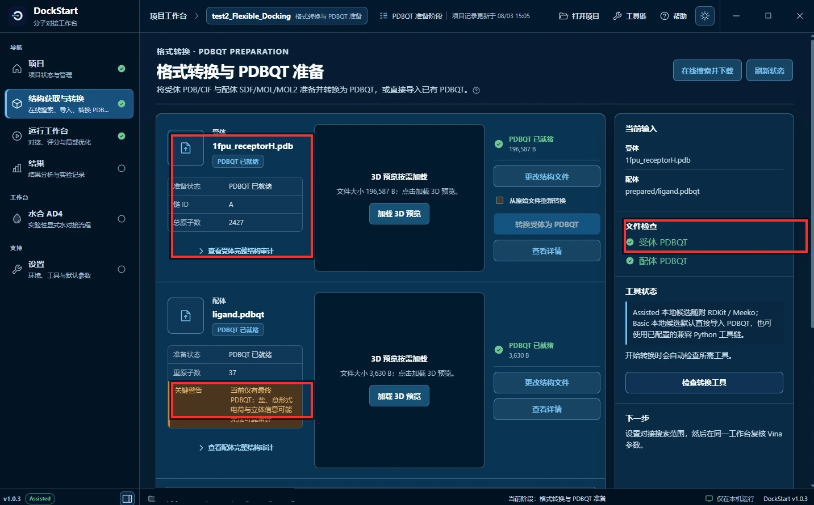
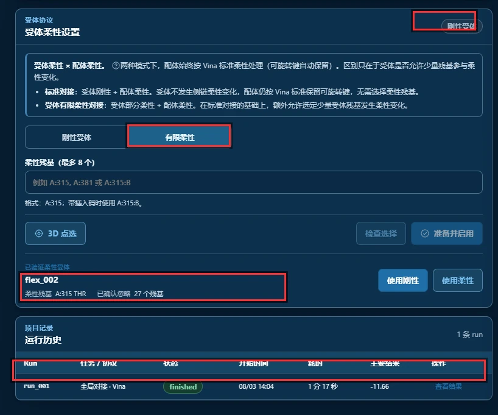
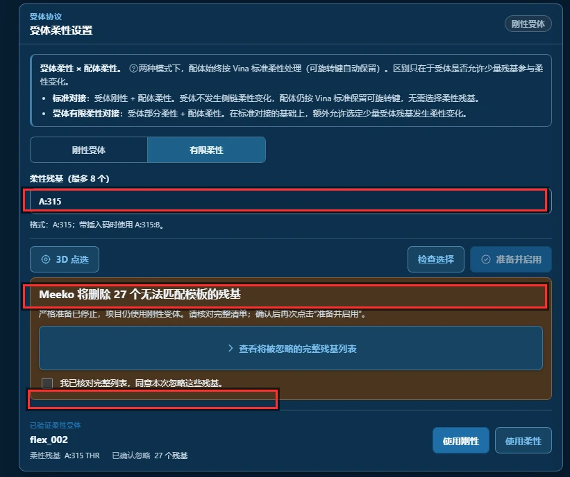
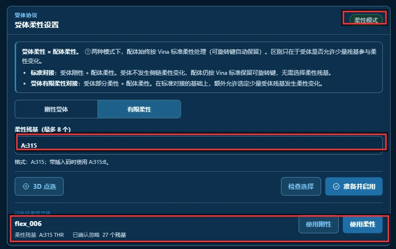
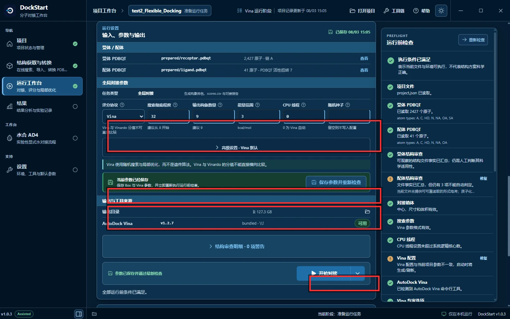
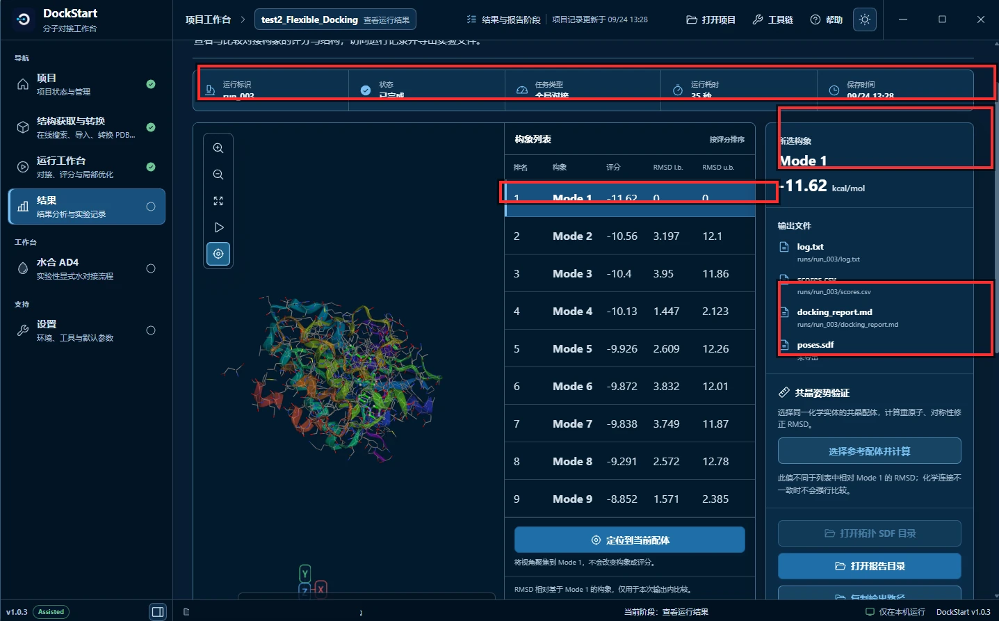
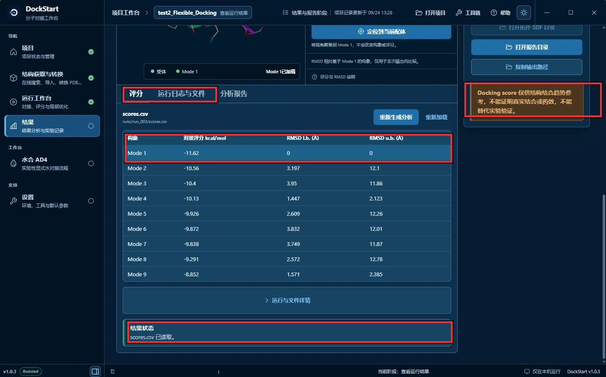

# Flexible Docking — 1FPU

## 简单概括

本例把伊马替尼对接到 c-Abl 的 1FPU 结构，并允许 Thr315 侧链参与搜索。操作上要指定柔性残基、完成结构审查，再确认有限柔性协议已启用。下面保留这次运行中的提示与结果，便于跟着核对。

---

## 先认识这个案例

**这是一次 cross-docking（交叉对接）。**

```text
B 节 1IEP    伊马替尼 → 对接进 1IEP（它自己所在的晶体结构）
C 节 1FPU    伊马替尼 → 对接进 1FPU（另一个 c-Abl 结构）
```

| 项目 | 内容 |
| --- | --- |
| 受体 | c-Abl 激酶结构域，PDB 编号 [1FPU](https://www.rcsb.org/structure/1FPU) |
| 配体 | **仍然是伊马替尼**，直接复用 B 节的 `1iep_ligand.pdbqt` |
| 柔性残基 | `A:315`（Thr315），只设这一个 |
| 搜索框中心 | `15.190, 53.903, 16.917`（与 B 节完全相同） |
| 搜索框尺寸 | `20 × 20 × 20 Å`（与 B 节官方值相同） |
| 官方 Vina 期望值 | 最佳构象约 **-11.63 kcal/mol** |
| 官方 AutoDock4 期望值 | 最佳构象约 **-14.2 kcal/mol** |

以上数值均来自 [AutoDock Vina 官方 Flexible docking 教程](https://github.com/ccsb-scripps/AutoDock-Vina/blob/develop/docs/source/docking_flexible.rst)。
官方 `data/` 目录里只有两个文件，都是本次要用的输入：

```text
1fpu_receptorH.pdb      348,010 B    受体，已加氢
1iep_ligand.pdbqt         3,630 B    配体 —— 注意文件名还是 1iep，因为就是复用 B 节那个
```

> 官方教程在这里加了一句总结：**"The lack of receptor flexibility is arguably the greatest limitation in these types of docking methods."**
> 受体不能动，是这类对接方法最大的局限。本节做的，就是在这个局限上开一个很小的口子。

---

## 官方每一步 → DockStart 怎么对应

| # | 官方（命令行） | DockStart 里怎么做 | 状态 |
| --- | --- | --- | --- |
| 1 | `-f A:315` 指定柔性残基 | **受体柔性设置 → 有限柔性 → 柔性残基填 `A:315`** | ✅ 等价，本节重点 |
| 2 | `-a` 忽略无法匹配模板的残基 | **严格模式的坏残基审查 → 勾选允许** | ⚠️ 见第 3 步，不勾就不生效 |
| 3 | 产出 `1fpu_receptor_rigid.pdbqt` + `1fpu_receptor_flex.pdbqt` | DockStart 自动拆（本次 2422 + 5 = 2427 原子） | ✅ 等价 |
| 4 | 复用 `1iep_ligand.pdbqt` | 直接导入同一个配体文件，不必重新准备 | ✅ 等价 |
| 5 | `--box_size 20 20 20 --box_center 15.190 53.903 16.917` | Grid Box 六个输入框 | ✅ 等价 |
| 6 | `--exhaustiveness 32` | 搜索彻底程度填 `32` | ✅ 等价 |
| 7 | （可选）`-g` + `autogrid4`，**只对 rigid 部分**算 maps | 选 AutoDock4 协议时 DockStart 自动做，同样只对 rigid 算 | ✅ 等价 |
| 8 | `mk_export.py` 把结果转 SDF | 结果页「打开拓扑 SDF 目录」 | ⚠️ 本次未导出，见第 8 步 |

---

## 整条流程长什么样？

```text
第 1 步  准备结构：受体 1fpu_receptorH.pdb + 配体 1iep_ligand.pdbqt
第 2 步  把受体协议从「刚性受体」切成「有限柔性」
第 3 步  指定柔性残基 A:315，并处理「坏残基」
第 4 步  确认柔性已经生效
第 5 步  检查 Grid Box（20 × 20 × 20）
第 6 步  确认运行参数（评分函数 Vina，搜索彻底程度 32）
第 7 步  运行
第 8 步  看结果：构象列表
第 9 步  看结果：评分表
```

**只有第 2、3、4 步是本节新增的。** 其余步骤和 B 节一样，只是受体文件与配体文件换了。

---

## 第 1 步：准备结构



**图 1**　格式转换与 PDBQT 准备。

红框圈出的三处：

**① 受体准备状态。** `PDBQT 已就绪`，大小 196,587 B，**链 ID `A`**，**总原子数 2,427**。

这个 2427 值得记一下，因为它是后面柔性拆分的基础：

```text
刚性部分  2,422 原子
柔性部分      5 原子      ← Thr315 侧链（CB、CG2、OG1 加一个极性氢）
合计      2,427 原子
```

**② 配体的橙色「关键警告」。** 和 B 节同一条：

```text
当前仅有重原子 PDBQT；
盐、总形式电荷与立体信息可能无法可靠审计
```

**③ 右侧「文件检查」两项都是 ✓。** 和 B 节一样，这是进入下一步的通行证。

配体文件名是 `ligand.pdbqt`，但它就是 B 节那个伊马替尼——**cross-docking 的重点在于"换受体不换配体"**，用同一个分子去问另一个结构："你把它放在哪儿？"

---

## 第 2 步：把受体切成「有限柔性」



**图 2**　受体柔性设置。

红框圈出的四处：

**① 右上角的协议徽标，此刻仍显示「刚性受体」。**

切换页签后，项目当前使用的协议还没有改变。必须走完第 3 步、点「准备并启用」并且成功，徽标才会变成柔性。

**② 「有限柔性」页签被选中。** 两个选项的区别，界面上的原文写得很清楚：

```text
标准对接       受体刚性 + 配体柔性
               受体不发生侧链柔性变化，配体仍按 Vina 标准保留可旋转键，无需选择柔性残基。

受体有限柔性   受体部分柔性 + 配体柔性
               在标准对接的基础上，额外允许选定少量受体残基发生柔性变化。
```

**两种模式下，配体始终是按 Vina 标准柔性处理的**，区别只在于受体让不让步。所以 B 节和 C 节的差别，**只有受体这一处**。

**③ 已验证柔性受体 `flex_002`。**

```text
flex_002
柔性残基 A:315 THR    已确认忽略 27 个残基
```

这一行说明：**这个项目里已经准备好一份柔性受体**，残基是 A:315，同时在准备时忽略了 27 个无法匹配模板的残基（对应官方的 `-a`）。它是否"生效"，取决于接下来第 3 步。

**④ 运行历史里的 `run_001`。**

```text
run_001   全局对接 · Vina   finished   08/03 14:04   1 分 17 秒   -11.66
```

这是这个项目**此前**的一次柔性运行，结果 -11.66。本节后面会拿它和本次新跑的 `run_003` 对照。

---

## 第 3 步：指定柔性残基 A:315，并处理「坏残基」



**图 3**　填入柔性残基后，严格准备被拦住。

红框圈出的三处：

**① 柔性残基栏填入 `A:315`。**

```text
格式   A:315          链 A，残基号 315
       A:315:B        带插入码时用这种写法
```

官方命令里的 `-f A:315` 就是这一栏。界面在这里还标了一句 **「柔性残基（最多 8 个）」**——DockStart 的上限是 8 个残基。官方这个案例只用 1 个，远没到上限。

**② 橙色警告：`Meeko 将删除 27 个无法匹配模板的残基`。**

这一条就是官方的 `-a` 参数。官方文档的原话是：

> `-a` is the option to ignore residues that are only partially resolved and those fail to match with the templates.

也就是**丢弃那些只解出一部分、以及匹配不上模板的残基**。DockStart 在严格模式下会先检测、再让你确认：

```text
严格准备已停止，项目仍使用刚性受体。
请核对完整清单；确认后再次点击"准备并启用"。
```

注意"**项目仍使用刚性受体**"这句——**不确认就不会变柔性**。这也解释了图 2 里为什么徽标还是「刚性受体」。

**③ 勾选框：`我已核对完整列表，同意本次忽略这些残基。`**

**必须勾上，再点「准备并启用」。** 本次共忽略 **27 个**残基（和项目记录里的 A:226、A:229、A:230… 那张清单一致）。

实际写研究记录时，这一步不该无脑勾选——**要先点开「查看将被忽略的完整残基列表」确认这些残基不在结合位点附近**。本次的 27 个都是远离口袋的柔性末端，忽略是合理的。

---

## 第 4 步：确认柔性已经生效



**图 4**　柔性受体已激活。

这一屏是第 2、3 步做完之后**应该看到的样子**。红框圈出的三处，正好是"已经生效"的三个证据：

**① 右上角协议徽标变成「柔性模式」。**

图 2 里它还是「刚性受体」，现在变了。**这是判断柔性是否生效最快的一眼**——不用去翻文件。

**② 柔性残基栏保留着 `A:315`。**

**③ 已验证柔性受体一行，以及右下角两个按钮的主次调换了。**

```text
flex_006
柔性残基 A:315 THR    已确认忽略 27 个残基
```

图 2 里「使用刚性」是主按钮（蓝色高亮），现在**「使用柔性」变成了主按钮**。这个细节同样在告诉你：当前生效的是柔性。

> **关于 `flex_00X` 这个编号**：它是**逐次递增的准备记录**。每点一次「准备并启用」都会生成一条新记录（flex_001、flex_002……）。
> 图 2 拍摄时显示 `flex_002`，图 4 是 `flex_006`，而本次运行 `run_003` 实际绑定的是 `flex_004`。
> **三者记录的柔性残基与忽略清单完全相同**（A:315 / 27 个残基），所以编号差异不影响任何结论。
> 但要理解：**这个编号只表示"第几次准备"，不含任何科学含义。** 反复点「准备并启用」会不断产生新编号，看起来像做了很多不同的事，其实配置一模一样。

---

## 第 5 步：检查 Grid Box


**图 5**　搜索范围与运行前检查。

红框圈出的三处：

**① DOCKING BOX 体积 `8,000 ų`，绿色标签「范围可用」。**

**8,000 = 20³**，正好对应官方的 `--box_size 20 20 20`。

> 对照 B 节：那里的截图显示的是 `8,303.8 ų`，也就是 `20.25³`。**本节这次与官方完全一致**，不用再做任何解释。

**② 中心与尺寸六个数值。**

```text
中心 X  15.19        尺寸 X  20
中心 Y  53.903       尺寸 Y  20
中心 Z  16.917       尺寸 Z  20
```

与官方 `--box_center 15.190 53.903 16.917`、`--box_size 20 20 20` **逐项一致**。

中心值和 B 节一样并不奇怪——1IEP 和 1FPU 都是 c-Abl 的激酶结构域，结合的是同一个口袋。

**③ 运行前检查里两条「维修」。**

```text
受体结构审查   可疑的结构事实已汇总；仍需人工判断其科学适用性。
配体结构审查   文件事实已汇总，但仍有 3 项不能自动判定……
```

这两条不是报错，但它们提醒你：**结果的可靠性建立在一批未经人工判断的结构事实上**。

---

## 第 6 步：确认运行参数



**图 6**　输入、参数与输出。

红框圈出的四处：

**① 六个对接参数：**

| 参数 | 本次取值 | 说明 |
| --- | --- | --- |
| 评分函数 | `Vina` | 官方 4.b 用的就是这个 |
| 搜索彻底程度 | **`32`** | 官方明确要求，**不是默认的 8** |
| 输出构象数量 | `9` | 官方输出正是 9 个 mode |
| 能量范围 | `3` | Vina 默认 |
| CPU 线程 | `0` | 官方 `CPU: 0` |
| 随机种子 | 留空 | 官方每次随机 |

**搜索彻底程度 32 是本节与 B 节的第二个差别。** B 节那次用的是默认的 8，结果比官方低了 0.65 kcal/mol；这次按官方要求填 32，结果直接对上了（见后面第 8 步）。

**② 绿色条「当前参数已保存」。** 改完参数必须保存并重新检查。

**③ 输出目录与工具来源。** 输出目录要留足空间；`可用` 说明 DockStart 自带 Vina。

**④ 右下角「开始对接」。**

> **⚠️ 关于受体柔性到底有没有传下去，这里有一个真实的坑。**
> 运行完成后，项目里会导出 `configs/vina_config.txt`，但**那个文件里没有 `flex` 行**——它只写了 `receptor = .../receptor_rigid.pdbqt`。
> 而实际执行的命令是 `vina.exe --config ... --flex .../flex.pdbqt`，Vina 自己的日志里也明确有 `Flex receptor:` 一行。
> 也就是说 **flex 是走命令行传的，没写进导出的配置**。
> **结论：不要拿导出的那个 config 文件丢到命令行去重跑**——那会静默丢掉受体柔性，跑出来的是刚性对接。要复现柔性对接，必须回到 DockStart 里跑。

---

## 第 7 步：运行完成


**图 7**　运行完成的状态条。

红框圈出的两处：

**① 输出目录与剩余空间** —— 柔性对接要先算一次网格，确认盘上空间够。

**② `完整流程已完成`**

```text
run_003 · 35 秒
AutoDock Vina 运行完成。
```

**记下 `run_003` 这个编号**，下一步看结果时要靠它确认看的是哪一次。"完整流程"这四个字也很重要——它表示 docking、评分解析、报告生成都跑完了，不是只跑了一半。

---

## 第 8 步：看结果——构象列表



**图 8**　结果 → 查看运行结果，`run_003`（**柔性 Vina**）。

红框圈出的四处：

**① 顶部运行信息条。**

```text
运行标识   run_003
状态       已完成
任务类型   全局对接
运行耗时   35 秒
保存时间   09/24 13:28
```

**② 构象列表** —— 9 个 pose 按分数从好到差排列，`Mode 1` 高亮：

```text
Mode 1   -11.62       RMSD l.b. 0        RMSD u.b. 0
Mode 2   -10.56       3.197             12.1
Mode 3   -10.4        3.95              11.86
Mode 4   -10.13       1.447             2.123
Mode 5   -9.926       2.609             12.26
Mode 6   -9.872       3.832             12.01
Mode 7   -9.838       3.749             11.87
Mode 8   -9.291       2.572             12.78
Mode 9   -8.852       1.571             2.385
```

`Mode 1` 为 **-11.62 kcal/mol**。这个数字待会儿要和官方 -11.63 对。

**③ 右侧所选构象分值与输出文件。**

```text
所选构象   Mode 1   -11.62 kcal/mol
输出文件   log.txt / scores.csv / docking.report.md
           poses.sdf   未导出
```

`poses.sdf` 显示**未导出**——想看柔性残基和配体的实际构象，需要先点导出。本次没导出，所以本文没有展示构象图。

**④ 共晶姿势验证。** 用它可以把预测姿势和晶体结构里的真实配体位置做比较。

---

## 第 9 步：看结果——评分表



**图 9**　「评分」（`scores.csv`）标签页。

红框圈出的四处：

**① 三个标签** —— 评分 / 运行日志与文件 / 分析报告。

**② 表头与 Mode 1 行。** 表头写的是「**对接评分**」，说明这是 Vina 力场（如果是 AutoDock4 会写「AutoDock4 评分」）：

| 构象 | 对接评分 kcal/mol | RMSD l.b. (Å) | RMSD u.b. (Å) |
| --- | --- | --- | --- |
| Mode 1 | -11.62 | 0 | 0 |
| Mode 2 | -10.56 | 3.197 | 12.1 |
| Mode 3 | -10.4 | 3.95 | 11.86 |
| Mode 4 | -10.13 | 1.447 | 2.123 |
| Mode 5 | -9.926 | 2.609 | 12.26 |
| Mode 6 | -9.872 | 3.832 | 12.01 |
| Mode 7 | -9.838 | 3.749 | 11.87 |
| Mode 8 | -9.291 | 2.572 | 12.78 |
| Mode 9 | -8.852 | 1.571 | 2.385 |

**③ 结果状态** —— `scores.csv 已读取`。

**④ 科学边界** —— 每次都在提醒：

> `Docking score 仅供结构结合趋势参考，不能证明真实结合或药效，不能替代实验验证。`

---

## 结果合理吗？与官方逐项对照

**本次 `run_003`（柔性 Vina）与官方期望值逐条比较：**

| 构象 | 本次 run_003 | 官方 Vina | 差值 |
| --- | --- | --- | --- |
| Mode 1 | **-11.62** | **-11.63** | **+0.01** |
| Mode 2 | -10.56 | -10.57 | +0.01 |
| Mode 3 | -10.4 | -10.3 | -0.10 |
| Mode 4 | -10.13 | -9.906 | -0.224 |
| Mode 5 | -9.926 | -9.895 | -0.031 |
| Mode 6 | -9.872 | -9.854 | -0.018 |
| Mode 7 | -9.838 | -8.849 | -0.989 |
| Mode 8 | -9.291 | -8.758 | -0.533 |
| Mode 9 | -8.852 | -8.543 | -0.309 |

**Mode 1 相差 0.01 kcal/mol —— 这是完全复现。**

后面几个 mode 有零点几的出入，属于随机搜索的正常波动（官方文档自己给出的是**单次**运行结果，而 Vina 的搜索带随机性，随机种子不同结果就会有细微差别）。

**再看同项目里此前的 `run_001`：**

| 运行 | 何时跑的 | 力场 | 耗时 | Mode 1 |
| --- | --- | --- | --- | --- |
| `run_001` | 08/03 14:04 | Vina 柔性 | 1 分 17 秒 | **-11.66** |
| `run_003` | 09/24 13:28 | Vina 柔性 | 35 秒 | **-11.62** |

**两次独立运行给出了几乎相同的答案（差 0.04），而且都贴着官方 -11.63。** 这是这条流程可复现的一个正面证据。

两次耗时差了 2 倍多，是因为它们跑在不同的机器上——**耗时不能横向比较，分数可以**。

> 顺带一提：这个项目里还有一次 `run_002`（33 秒），Vina 日志里算出了 -11.64，但**它没有生成 `scores.csv` 和报告**，所以运行记录里的"主要结果"是空的。
> 也就是说 **"docking 跑完"和"结果被完整记录"是两件事**。看到某一行的主要结果为空，就知道那次的后续分析没走完，别把它当成一次可引用的结果。

---

## 关于「柔性」的三条边界

**① 柔性残基不是设得越多越好。**

界面上的原文值得抄下来：

> 并不是附近所有残基都需要设为柔性，通常只选择与结合口袋直接相关、且有合理结构依据的少量残基。
> 残基选择应基于结构和研究目的，而不是机械地把所有邻近残基都设为柔性。

**② 柔性对接更慢，而且不保证更准。**

本节之所以要跑柔性，是因为官方案例**特别指定了 Thr315**——这是有结构依据的选择，不是"试试看让受体动起来会不会分更高"。没有依据就加柔性残基，只会增加搜索空间、拉长耗时，结果还更难解释。

**③ 柔性不改变"分数不可比"这条规则。**

官方在柔性教程里又强调了一遍：**AutoDock 力场和 Vina 力场的分数不可互相比较**。所以本节的 Vina -11.62 和可能跑出的 AD4 约 -14.2 之间，**不存在谁更好的问题**。

另外要知道 DockStart 的硬性上限：**最多 8 个柔性残基**。官方这个案例只用 1 个。

---

## 关于本篇截图

**① 这次是从一个已有项目上继续做的。**

```text
图 1 – 图 6    打开参考项目 test2_Flexible_Docking 时的页面
图 2 – 图 4    本次在界面上做的柔性受体准备（本节新增的操作）
图 7 – 图 9    本次运行 run_003 的结果
```

也就是说：**结构准备与参数是项目里已有的**，本次实际动手做的只有「切成有限柔性 + 指定 A:315 + 确认坏残基 + 确认生效」这几步，然后重跑了一次。这一点和第 2 步里 `flex_002` 已经存在是吻合的。

**② 三个运行编号和三种柔性准备编号要分清。**

```text
run_001        该项目此前的一次柔性运行          -11.66   （图 2 的运行历史里能看到）
run_002        跑完但未完成分析                  无记录   （正文已说明）
run_003        本次运行的结果                    -11.62   （图 7、图 8、图 9）

flex_002       图 2 拍摄时显示的柔性受体准备记录
flex_004       本次 run_003 实际绑定的那一份
flex_006       图 4 拍摄时显示的柔性受体准备记录
               三者的柔性残基与忽略清单完全相同：A:315 / 27 个残基
```

**③ 图 2、图 3、图 4、图 7 是局部截图。** 它们只截取了界面上的面板，没有窗口边框与底部状态栏，所以尺寸比其他图小。这样裁的好处是聚焦，代价是和整窗截图并排时观感不一致。

**④ 截图中的本机路径已做打码处理。** 图 1、图 5、图 6、图 8、图 9 底部状态栏的项目路径，以及图 6、图 7 中「输出目录」与 DockStart 自带 Vina 的安装路径，都已被遮盖。**你自己的目录不必和它一样**，任何路径都可以，只要空间够、不含中文。

**⑤ 本次没有导出 `poses.sdf`**，所以本文没有展示柔性残基的实际构象。DockStart 会把每个 pose 里柔性残基的位移单独记录在 `runs/run_00X/flexible_movement.json`，但**界面上没有专门的展示视图**——想看构象，需要导出 SDF 后用分子查看器打开。

**⑥ 判断柔性是否真的生效，有两个办法。** 界面上看第 4 步那个徽标（最快）；文件里看 `runs/run_00X/log.txt` 有没有 `Flex receptor:` 这一行（最可靠）。本次 `run_003` 两者都满足。

---

## 总结

选择有限柔性并填写 `A:315` 后，还要完成审查与“准备并启用”，确认项目已切换为柔性模式。本次采用 `20 × 20 × 20 Å` 的 Box 和 exhaustiveness `32`，Mode 1 为 `-11.62`，接近官方 `-11.63`。复现时要同时保留刚性受体、柔性侧链和配体文件。

---

<details className="guide-references">
<summary id="参考资料">参考资料</summary>

1. AutoDock Vina 官方 Flexible docking 教程（1FPU / Thr315、`-f A:315`、`-a`、Box 设置与两套期望结果）。
2. RCSB PDB 条目 [1FPU](https://www.rcsb.org/structure/1FPU)（c-Abl 激酶结构域）。
3. 官方教程 *1. Preparing the flexible receptor*（`mk_prepare_receptor.py ... -f A:315 -a` 的原始用法与 `-a` 的含义）。
4. 官方教程 *5. Results*（`-14.2` 与 `-11.63` 两个期望值及完整输出表）。
5. DockStart 界面：受体柔性设置、严格模式坏残基审查、运行前检查、结果页（截图来源）。

</details>

## 继续阅读

- 上一个案例：[Basic Docking — 1IEP](./basic-docking-1iep.md)
- 柔性与刚性的基础概念：[刚性受体与柔性配体](../../part-a/docking-components/rigid-and-flexible.md)
- 搜索彻底程度的影响：[Exhaustiveness](../../part-a/search-and-parameters/exhaustiveness.md)
- 搜索范围的设定：[Box 与 Maps FAQ](../../part-c/faq-box-and-maps.md)
- 结果怎么读：[如何正确解读结果](../../part-c/interpreting-results.md)
- 同一条流程的 AD4 maps 分支：[AutoDock4 Maps 工作流](./autodock4-maps-workflow.md)
