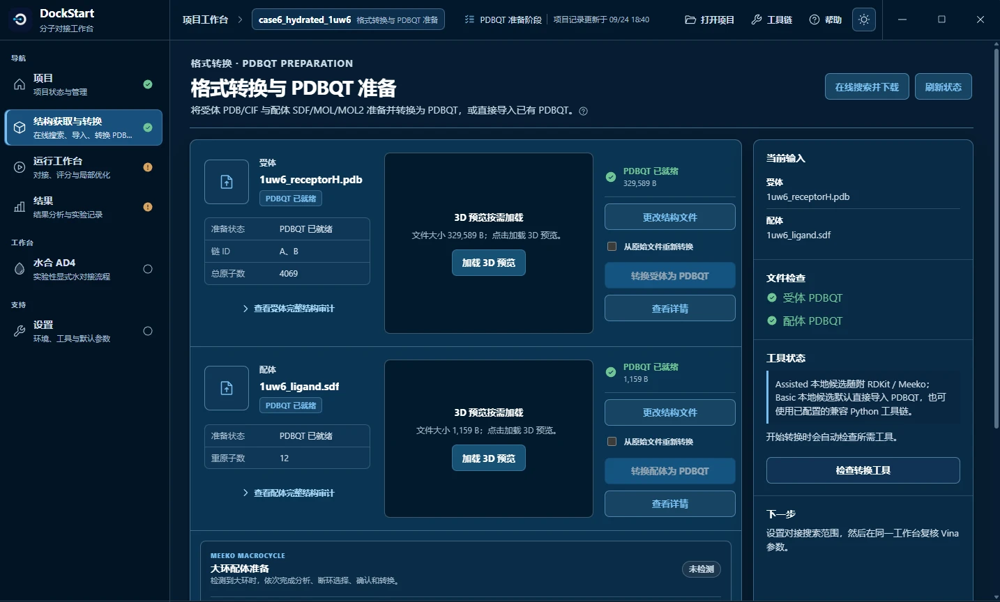
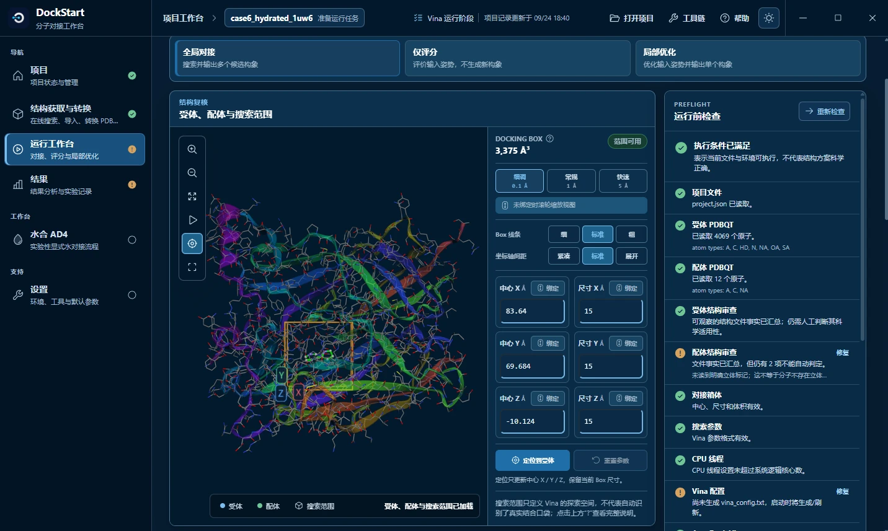
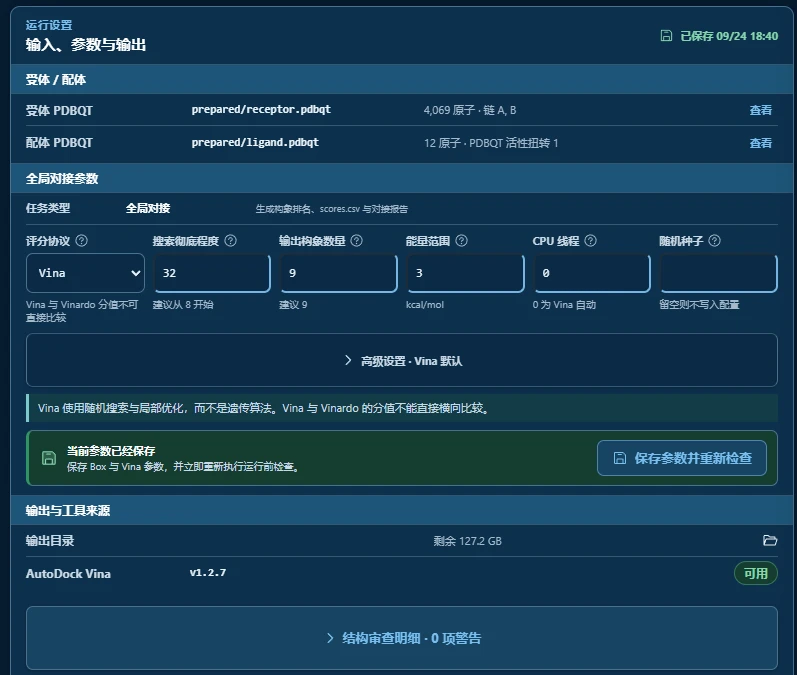
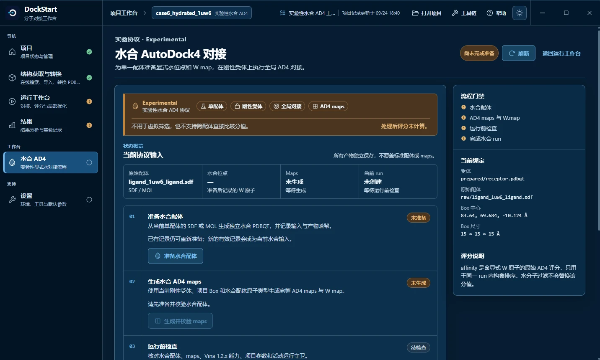
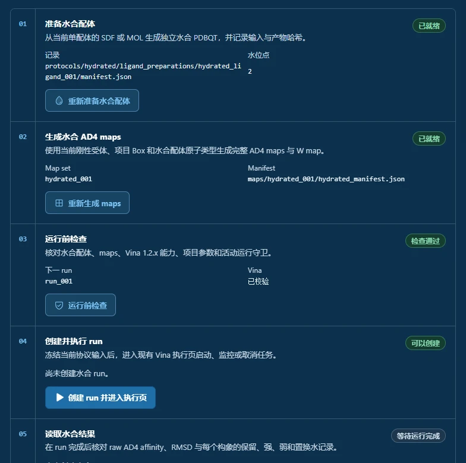
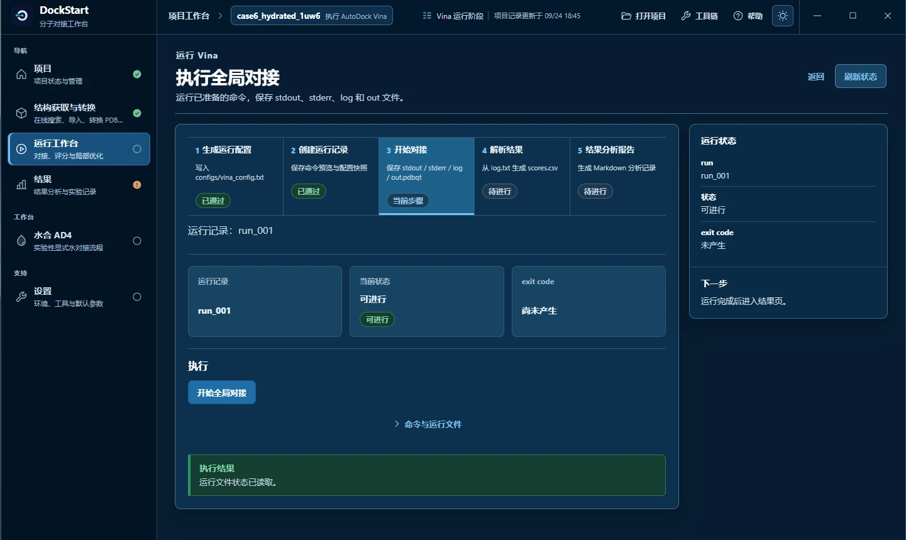
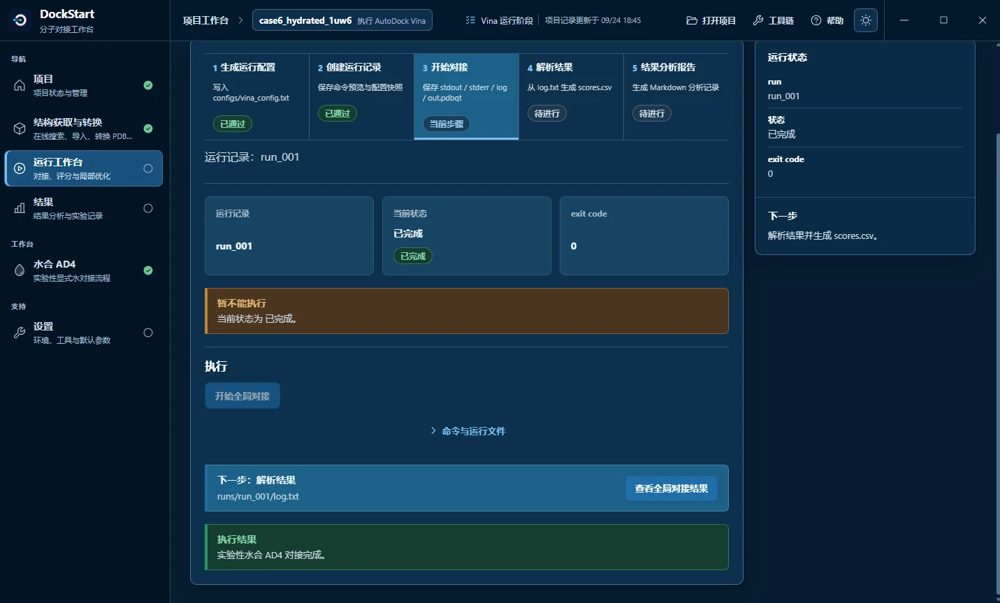
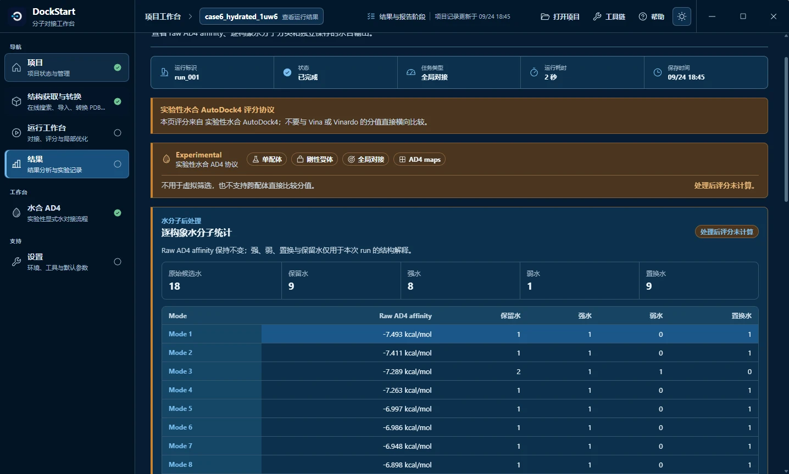
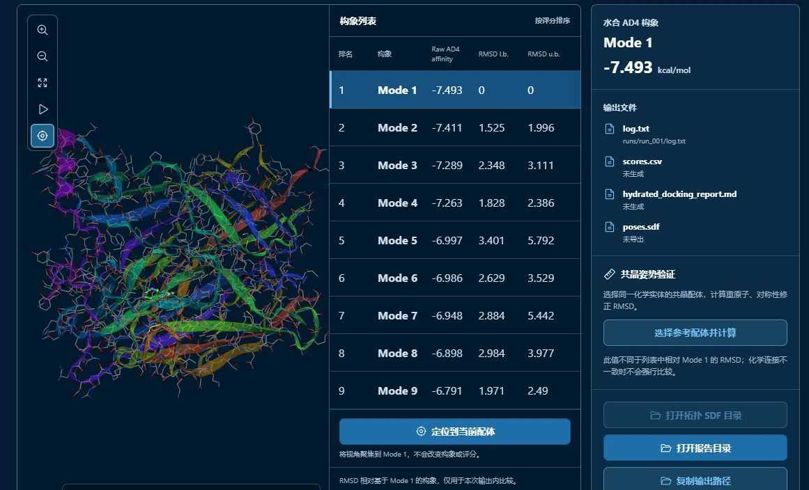
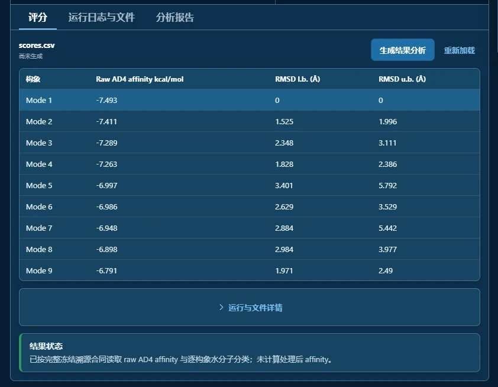

import OfficialExampleFiles from '@site/src/components/OfficialExampleFiles';
import DocNotes, {DocNote, NoteRef} from '@site/src/components/DocNotes';

# Hydrated Docking — 1UW6

用 1UW6 与尼古丁练习水合 AD4：准备带候选水的配体、生成 maps，再运行并查看水的保留与置换。

本例使用**刚性受体、单配体、全局对接**，需要外部 AutoGrid4 4.2.6+。水合评分用于本次构象比较，不用于跨配体排名。

## 官方三维结构文件 {#official-structure-files}

<OfficialExampleFiles example="hydrated"/>

## 案例设置

| 项目 | 内容 |
| --- | --- |
| 受体 | 乙酰胆碱结合蛋白（AChBP），PDB `1UW6`，官方文件 `1uw6_receptorH.pdb` |
| 配体 | **尼古丁**（fragment 级小分子），官方文件 `1uw6_ligand.sdf` |
| 加了几个候选水 | **2 个** |
| 搜索框中心 | `83.640, 69.684, -10.124` |
| 搜索框尺寸 | **`15 × 15 × 15 Å`** ← 注意是 15，不是 20 |
| 搜索彻底程度 | `32` |
| 官方 AD4 参考值 | 最佳构象 **-8.261 kcal/mol** |
| 本次实测 | **-7.493 kcal/mol**（2 秒） |

## 第 1 步：准备受体和配体 PDBQT

**图 1**　准备完成的状态。

导入 `1uw6_receptorH.pdb` 与 `1uw6_ligand.sdf`，完成两项标准 PDBQT 准备，进入运行工作台。保留原始 SDF，水合向导会用它另行生成水合配体。

## 第 2 步：设置搜索范围

**图 2**　搜索范围与运行前检查。

中心填 `83.640, 69.684, -10.124`，尺寸填 `15 × 15 × 15 Å`。保存并检查对接箱体的位置。

## 第 3 步：设置 Vina 参数

**图 3**　输入、参数与输出。

搜索彻底程度设为 `32`，输出构象数量 `9`，能量范围 `3`，CPU `0`。保存参数即可，先不运行普通 Vina 对接。

水合向导会使用 AD4 评分，无需在此手动切换评分协议。

## 第 4 步：进入水合向导

**图 4**　水合向导的起始状态。

进入「水合 AutoDock4 对接」。在「当前绑定」中确认受体已准备，并能找到原始配体 SDF/MOL。若受体显示「未准备」，先返回完成受体转换。

## 第 5 步：走完向导的 ①②③

**图 5**　前三步就绪后，核对向导中的输入、maps 与预检查状态。

按顺序完成「准备水合配体」→「生成水合 AD4 maps」→「运行前检查」。三项都就绪后再继续；截图中有 `2` 个水位点。

运行前检查只核对条件，还未启动对接。

## 第 6 步：创建并执行 run

**图 6**　执行页，run 已创建但还没跑。

**图 7**　执行完成。

点击「创建并执行 run」，在执行页开始对接。等待状态变为「已完成」，检查退出码为 `0`，再打开结果。

## 第 7 步：读水分子后处理

**图 8**　水分子后处理：查看每个构象的水分类与处理状态。

查看每个构象的保留水、强水、弱水与置换水。截图汇总为候选水 `18`、保留 `9`、置换 `9`。

水分类帮助解释结构，页面中的分数仍为原始 AD4 评分。

## 第 8 步：看结果

**图 9**　构象列表。

**图 10**　评分表视图。

点选构象查看配体与水的位置。截图 Mode 1 为 **-7.493 kcal/mol**，官方参考为 **-8.261 kcal/mol**。<NoteRef number={3}/>

若 CSV 或报告显示「未生成」，点击「生成结果分析」；需要在其他查看器中打开时，另行导出 SDF。

## 继续阅读

- 上一个案例：[Macrocycle Docking — BACE1](./macrocycle-docking-bace1.md)
- AutoGrid4 的获取与配置：[配置 AutoGrid4](../../part-c/autogrid4-setup.md)
- 结构准备 FAQ：[结构准备 FAQ](../../part-c/faq-structure-preparation.md)
- 为什么结果不一致：[为什么结果不一致](../../part-c/why-results-differ.md)
- 高级协议的适用范围：[高级协议的适用范围](../../part-c/advanced-protocols.md)

<DocNotes example="hydrated">

<DocNote number={2} title="截图与运行记录">

截图来自项目 `case6_hydrated_1uw6` 的历史 `run_001`，耗时 2 秒，退出码 0，未作为 v1.0.4 的新一轮验收。maps 为 `hydrated_001`，网格点数 `40 × 40 × 40`，间距 `0.375 Å`。本机路径已遮盖。

</DocNote>

<DocNote number={3} title="历史交叉对照">

| # | maps | 配体 | Mode 1 |
| --- | --- | --- | --- |
| **A** | 官方 | 官方 | **-8.261** |
| B | 官方 | DockStart | -7.321 |
| **C** | 本机 | DockStart | **-7.493** ← 本次实测 |
| D | 本机（补 `N` 图） | 官方 | -7.623 |

历史记录中，在官方 maps 下更换配体得到 `+0.940 kcal/mol` 的差异；同一 DockStart 配体更换 maps 得到 `-0.172 kcal/mol` 的差异。这提示需复查质子化与受体原子分型；一次对照不足以排除所有其他因素。

</DocNote>

<DocNote number={4} title="水合协议的适用范围">

官方协议以 AutoDock4 力场校准，不建议改用 Vina/Vinardo；当前实现不用于虚拟筛选或跨配体直接评分比较。RMSD 两列相对本次 Mode 1；水分类不另算处理后 affinity。

Docking score 仅供结构结合趋势参考，不能替代实验验证。

</DocNote>

</DocNotes>

参考资料

1. AutoDock Vina 官方教程 [Hydrated docking](https://github.com/ccsb-scripps/AutoDock-Vina/blob/develop/docs/source/docking_hydrated.rst)（方法三步、2 个候选水、GPF 全文、`mapwater.py` 与 `dry.py` 输出、期望值 -8.261、两条力场与虚拟筛选警告）。
2. 官方示例目录 [`example/hydrated_docking`](https://github.com/ccsb-scripps/AutoDock-Vina/tree/develop/example/hydrated_docking)（`data/` 提供受体与配体；`solution/` 提供配体 PDBQT、maps、GPF 与参考输出）。
3. 官方 `solution/1uw6_receptor.W.map`、`solution/1uw6_receptor.gpf`、`solution/1uw6_ligand.pdbqt`、`solution/boron-silicon-atom_par.dat`（本节对照实验直接用到的文件）。
4. 相关论文（官方推荐引用）：Forli & Olson (2012) *J Med Chem* 55(2), 623-638（discrete displaceable waters 力场）；Forli et al. (2016) *Nature Protocols* 11(5), 905-919。
5. DockStart 界面：水合 AD4 页面（五步向导与流程门禁）、运行工作台、执行页、结果页（截图来源）。
6. DockStart 源码与项目记录：`backend/dockstart_core/hydrated.py`（`generate_hydrated_maps`、W map 派生、`_project_receptor_mode`）、`hydrated_run.py`（`{**project.vina, "scoring": "ad4"}` 冻结逻辑）、`preparation.py`（受体/配体准备）、以及项目内的 `maps/hydrated_001/hydrated_manifest.json`、`maps/hydrated_001/receptor.gpf`、`runs/run_001/log.txt`。
7. 操作步骤逐条说明：`DockStart-Docs-ShootScript-06-hydrated-1uw6.md`。

