import OfficialExampleFiles from '@site/src/components/OfficialExampleFiles';
import DocNotes, {DocNote, NoteRef} from '@site/src/components/DocNotes';

# Macrocycle Docking — BACE1

用 BACE1 大环配体练习断环审查：分析候选方案，在三维视图中确认断环键，再准备 PDBQT 并运行。

## 官方三维结构文件 {#official-structure-files}

<OfficialExampleFiles example="macrocycle"/>

## 案例设置

| 项目 | 内容 |
| --- | --- |
| 受体 | BACE1（β-分泌酶），官方文件 `BACE_1_receptorH.pdb` |
| 配体 | 官方文件 `BACE_1_ligand.mol2`（大环分子） |
| 搜索框中心 | `30.103, 6.152, 15.584` |
| 搜索框尺寸 | `20 × 20 × 20 Å` |
| 官方 Vina 期望值 | 最佳构象 **-11.170 kcal/mol** |
| 本次实测 | **-7.924 kcal/mol**（102 秒） |

## 第 1 步：新建项目

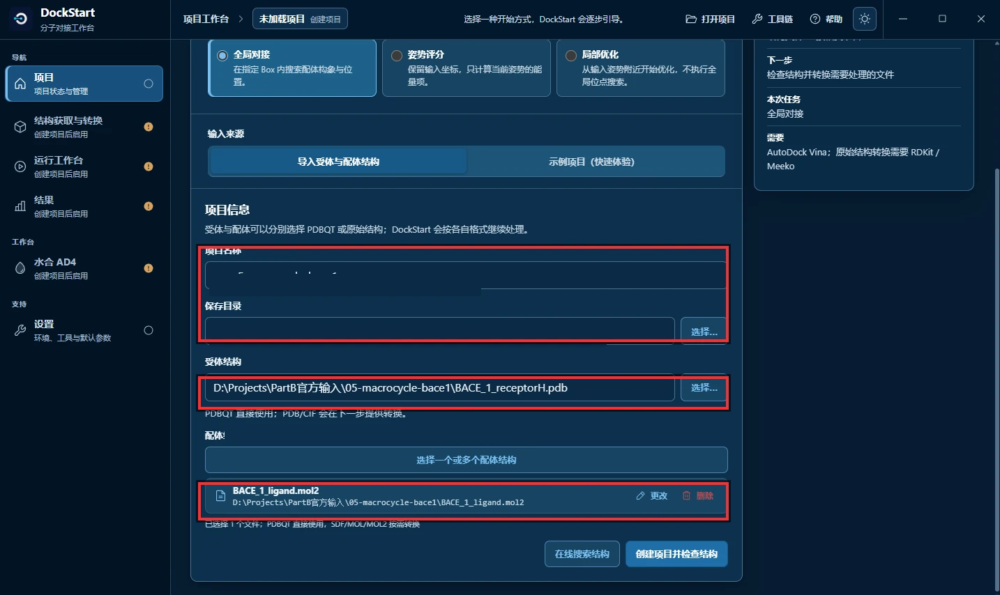

**图 1**　创建项目。

选择「全局对接」。受体选 `BACE_1_receptorH.pdb`，配体选 `BACE_1_ligand.mol2`，填写名称与保存目录。

## 第 2 步：准备——受体一次成功，配体第一次会失败

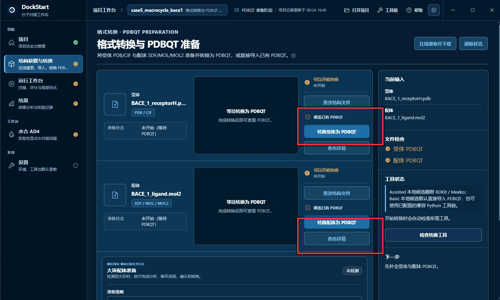

**图 2**　准备之前 —— **记住这一屏**。

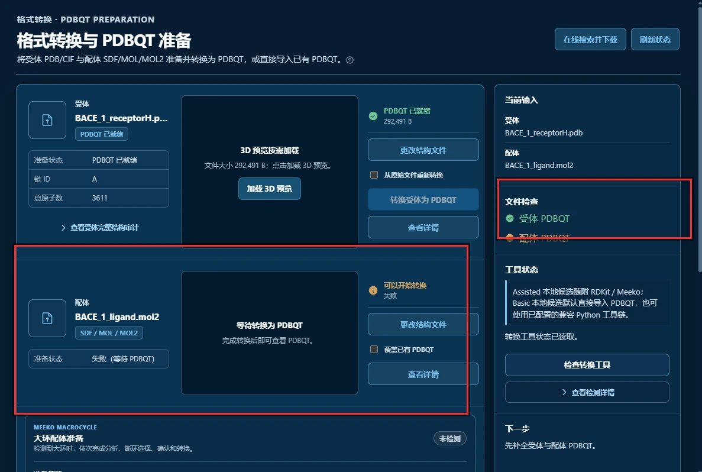

**图 3**　配体转换失败之后的样子。

先转换受体。配体因检测到大环而停止时，向下滚动到「大环配体准备」面板，继续审查。

## 第 3 步：切到「受审查的大环准备」

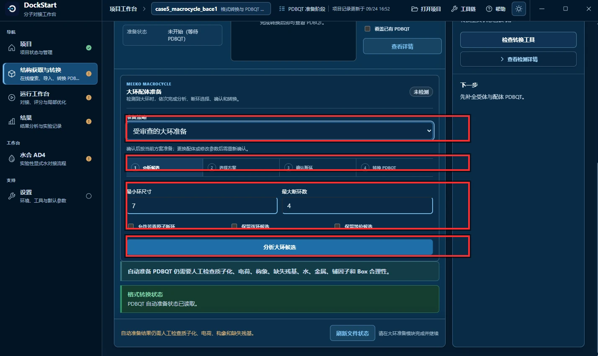

**图 4**　大环配体准备面板。

选择「受审查的大环准备」，保持最小环尺寸 `7`、最大断环数 `4`，点击「分析大环候选」。

若未检测到预期的大环，先检查配体文件和环尺寸阈值。

## 第 4 步：选断环组合

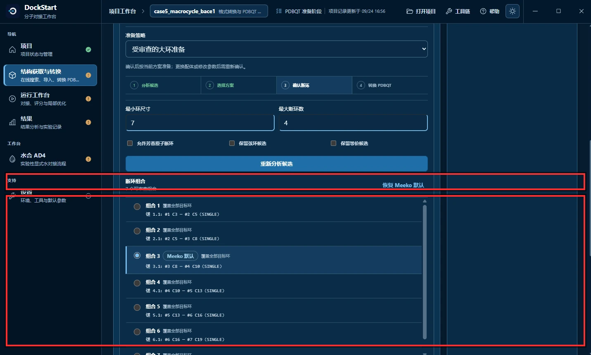

**图 5**　断环组合：在这里比较并选择候选方案。

查看候选组合，选择覆盖全部目标环的方案。截图选择「组合 3（Meeko 默认）」，对应 `#3 C8 – #4 C10`。

## 第 5 步：看断环键在 3D 里的位置

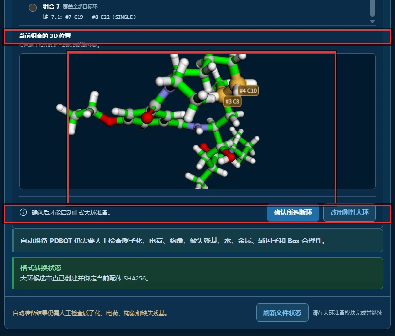

**图 6**　当前组合的 3D 位置。

在三维预览中核对橙色原子与连线，确认选择的断环键。点击「确认所选断环」；若研究需要保持环刚性，可改用「刚性大环」。

更换配体或修改准备参数后需重新确认。

## 第 6 步：确认并转换

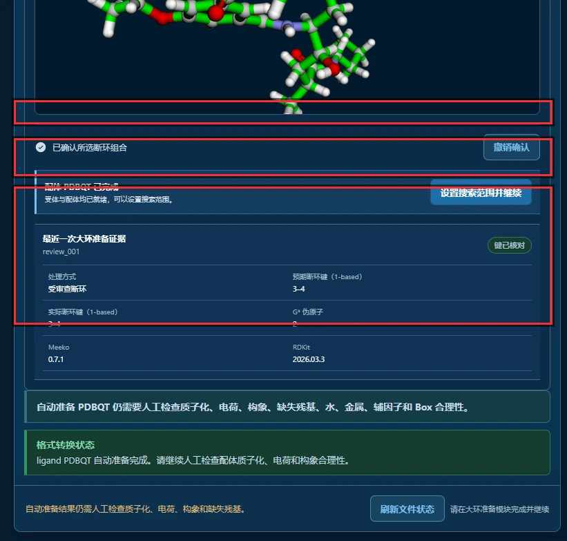

**图 7**　确认完成后，查看大环准备证据。

转换后，确认「配体 PDBQT 已完成」，预期断环键与实际断环键一致。截图两者均为 `3-4`，`G*` 伪原子为 `2`。

检查配体质子化、电荷与构象后，点击「设置搜索范围并继续」。

## 第 7 步：设定 Grid Box

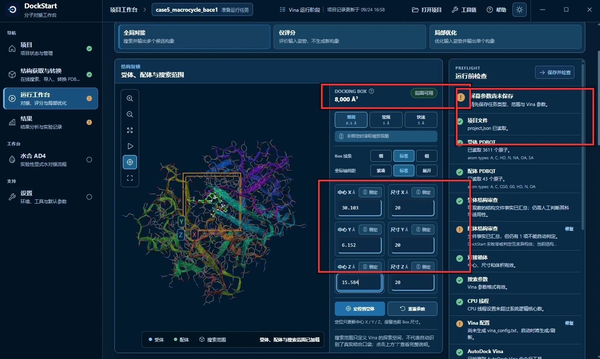

**图 8**　搜索范围与运行前检查。

中心填 `30.103, 6.152, 15.584`，尺寸填 `20 × 20 × 20 Å`。在三维视图中确认对接箱体的位置。

## 第 8 步：确认参数

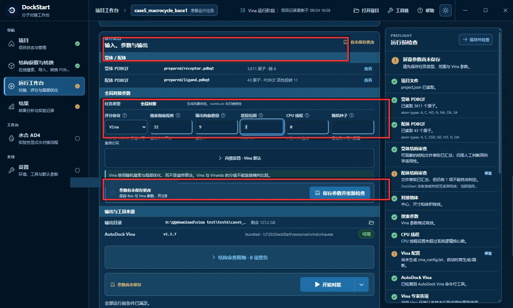

**图 9**　输入、参数与输出。

填写以下参数，保存并重新检查，然后开始对接。

| 参数 | 本次取值 |
| --- | --- |
| 评分函数 | `Vina` |
| 搜索彻底程度 | **`32`** |
| 输出构象数量 | `9` |
| 能量范围 | `3` |
| CPU 线程 | `0` |
| 随机种子 | 留空 |

## 第 9 步：看结果

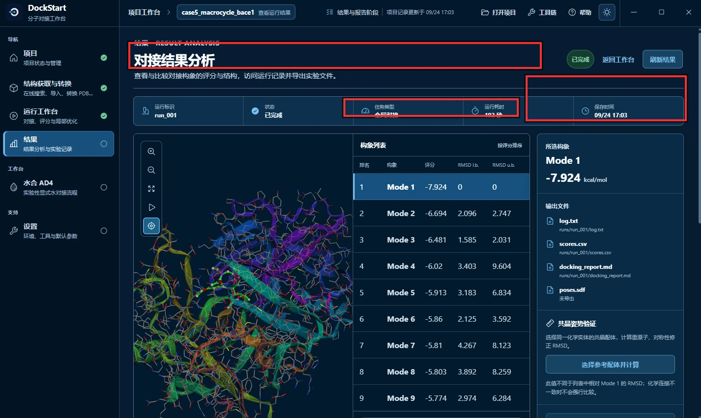

**图 10**　结果 → 对接结果分析，`run_001`。

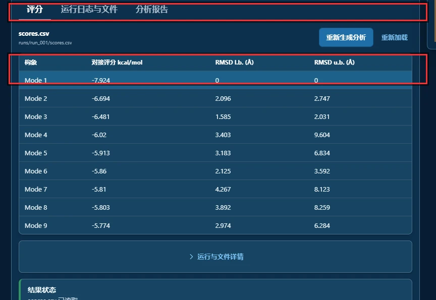

**图 11**　评分表。

查看构象与评分。截图的 Mode 1 为 **-7.924 kcal/mol**，官方参考为 **-11.170 kcal/mol**，尚未复现官方数值。需要进一步比较时，先核对断环方案和输入准备。<NoteRef number={3}/>

## 继续阅读

- 上一个案例：[Multiple Ligands Docking — 5X72](./multiple-ligands-docking-5x72.md)
- 大环配体的准备策略：[结构准备 FAQ](../../part-c/faq-structure-preparation.md)
- 搜索彻底程度的影响：[Exhaustiveness](../../part-a/search-and-parameters/exhaustiveness.md)
- 搜索范围的设定：[Box 与 Maps FAQ](../../part-c/faq-box-and-maps.md)
- 结果怎么读：[如何正确解读结果](../../part-c/interpreting-results.md)

<DocNotes example="macrocycle">

<DocNote number={2} title="截图与参数来源">

截图来自项目 `case5_macrocycle_bace1` 的历史 `run_001`，耗时 102 秒，未作为 v1.0.4 的新一轮验收。断环审查记录为 `review_001`；本机路径已遮盖，SDF 当时尚未导出。箱体取自官方 `BACE_1_receptor_vina_box.txt`，参考分数取自官方输出 PDBQT。

</DocNote>

<DocNote number={3} title="断环与结果对照">

官方输出记录 `Glue-bond [7] :: [8]`、两个 `G0` 伪原子和 `TORSDOF 12`；历史 DockStart 输入的活性扭转数为 `11`。不同文件的原子编号不能直接对应，尚需逐原子核对，不能仅凭编号或扭转数认定断环位置相同或不同。

提高搜索投入的历史试跑只改变约 `0.35 kcal/mol`，仍不足以排除搜索因素。「键已核对」表示准备结果符合所选方案，不表示与官方一致。

Docking score 仅供结构结合趋势参考，不能替代实验验证。

</DocNote>

</DocNotes>

参考资料

1. AutoDock Vina 官方教程 [Docking with macrocycles](https://github.com/ccsb-scripps/AutoDock-Vina/blob/develop/docs/source/docking_macrocycle.rst)（断环三步机制的原始说明，以及"Meeko 0.3.0 之后大环默认柔性"）。
2. 官方示例目录 [`example/docking_with_macrocycles`](https://github.com/ccsb-scripps/AutoDock-Vina/tree/develop/example/docking_with_macrocycles)（`data/` 提供受体与配体；`solution/` 提供 Box 文件与期望值）。
3. 官方 solution 文件 `solution/BACE_1_receptor_vina_box.txt`（Box 数值来源）与 `solution/BACE_1_ligand_vina_out.pdbqt`（`-11.170`、`Glue-bond [7]::[8]`、`TORSDOF 12`、dummy atom `*1`/`*2` 的来源）。
4. 相关论文（官方推荐引用）：Holcomb et al. (2022) *Performance evaluation of flexible macrocycle docking in AutoDock*, QRB Discovery 3, E18；Forli & Botta (2007) *JCIM* 47(4), 1481-1492；Santos-Martins et al. (2019) *J Comput Aided Mol Des* 33(12), 1071-1081。
5. DockStart 界面：格式转换与 PDBQT 准备、大环配体准备面板、运行前检查、结果页（截图来源）；以及项目记录 `preparation/macrocycle_reviews/review_001/confirmation_001.json`。

