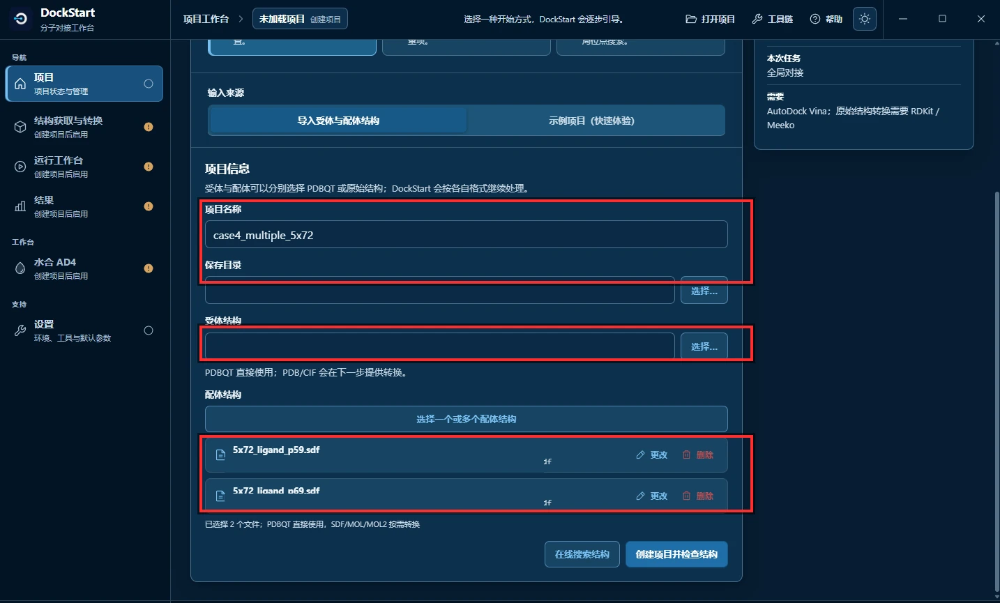
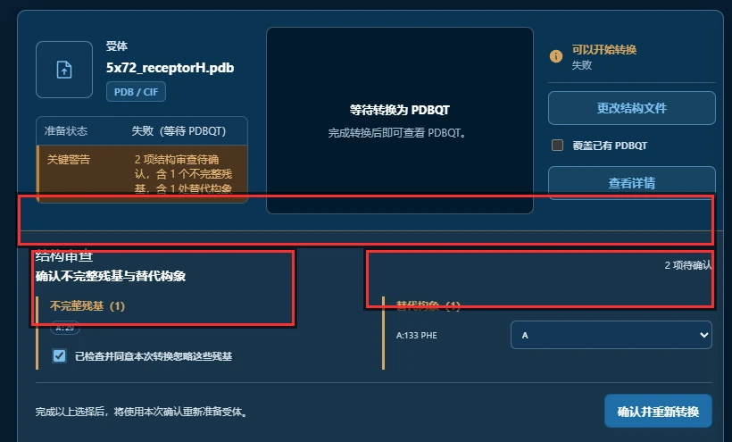
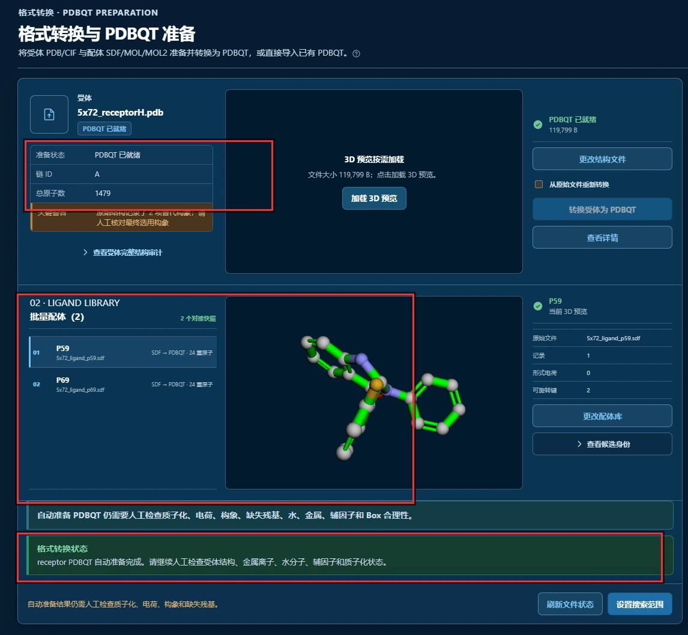
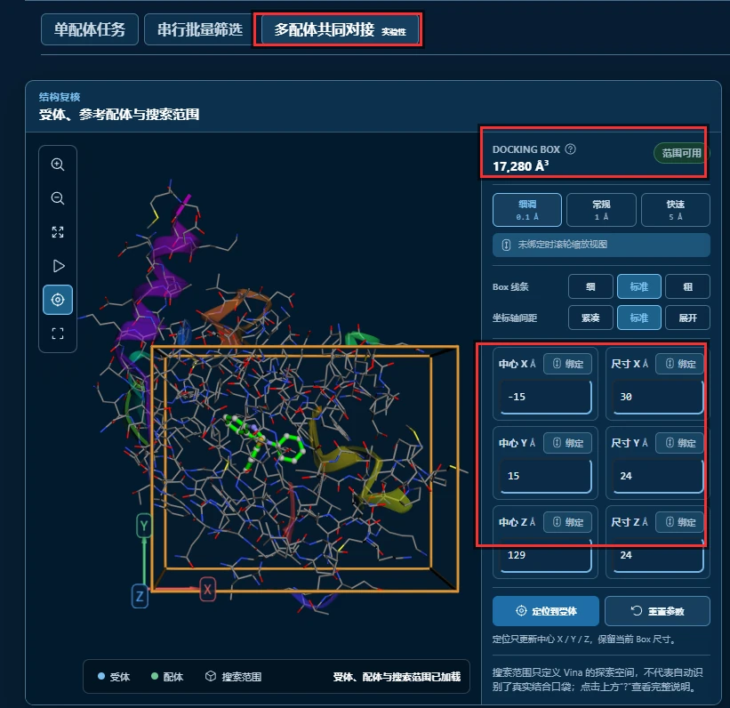
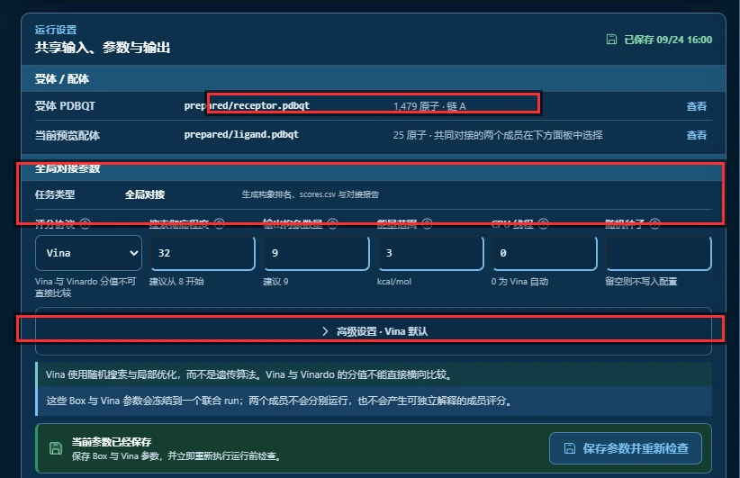
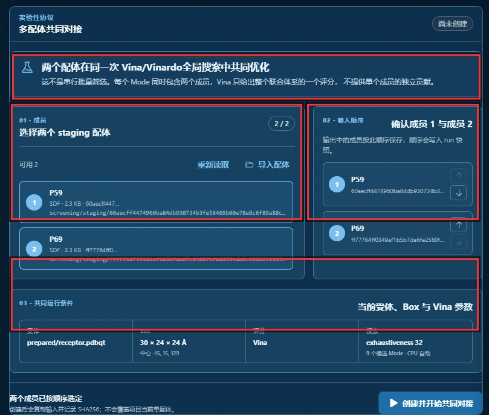
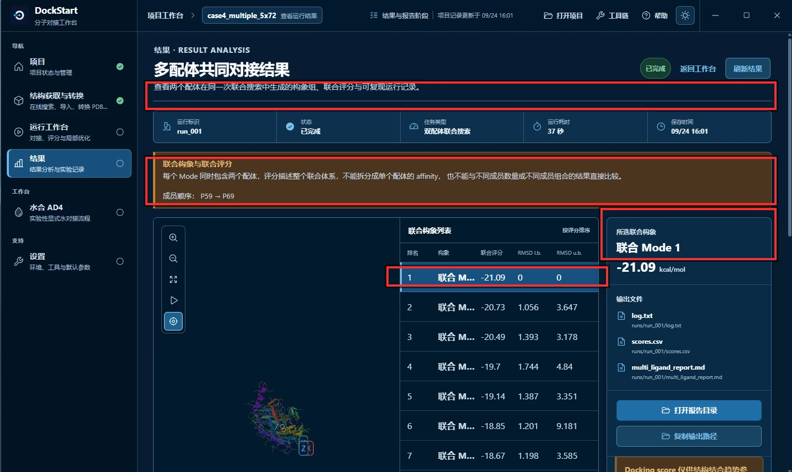
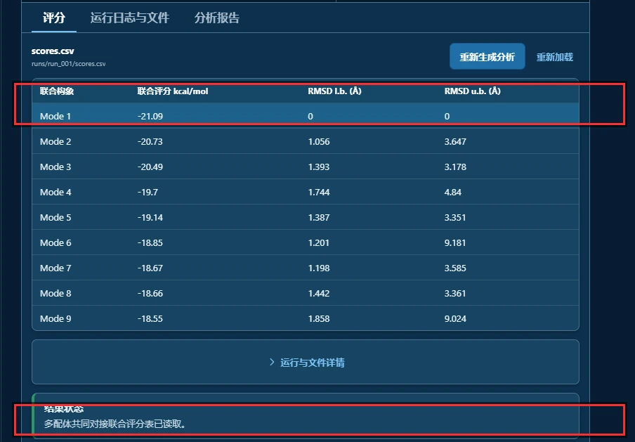

import OfficialExampleFiles from '@site/src/components/OfficialExampleFiles';

# Multiple Ligands Docking — 5X72

本例让 5X72 的两个配体在同一次全局搜索中优化。结果是联合构象与整个体系的评分，不能拆成单成员 affinity；如果想分别比较每个配体，应使用 D 节的批量筛选。

## 官方三维结构文件 {#official-structure-files}

<OfficialExampleFiles example="multiple"/>

---

## 先认识这个案例：两个立体异构体，同时进一个口袋

5X72 是**磷酸二酯酶（PDE）**与**两个抑制剂**的复合物。这两个抑制剂是一对**立体异构体**：

```text
R 构型    只能在口袋的某个特定区域结合
R 和 S    都能结合第二个位置
```

单配体对接分别搜索每个分子，不能直接描述两个分子在同一搜索中的联合构象。Vina 1.2 之后支持同时对接多个配体，正是为这类场景设计的。官方原话：

> Vina is now able to dock simultaneously multiple ligands. This functionality may find application in fragment based drug design, where small molecules that bind the same target can be grown or combined into larger compounds with potentially better affinity.

| 项目 | 内容 |
| --- | --- |
| 受体 | PDE，PDB 编号 [5X72](https://www.rcsb.org/structure/5X72) |
| 配体 | 5X72 里的两个抑制剂 **P59** 与 **P69**（立体异构体） |
| 搜索框中心 | `-15, 15, 129` |
| 搜索框尺寸 | `30 × 24 × 24 Å`（17,280 ų） |
| 官方 Vina 期望值 | 最佳联合评分约 **-19.04 kcal/mol** |
| 官方 AutoDock4 期望值 | 约 **-17.67 kcal/mol** |
| 本次实测 | **-21.09 kcal/mol**（37 秒） |

---

## 它和 D 节是两回事

**这两个案例用的是完全相同的受体和配体**（都是 5X72 的 P59 与 P69），唯一的区别是**怎么跑**：

| | D 节 串行批量筛选 | E 节 多配体共同对接（本节） |
| --- | --- | --- |
| 配体数量 | 一批（上限 500） | **固定 2 个** |
| 运行方式 | 依次、可恢复的队列 | **同一次全局搜索** |
| 结果形式 | **每个配体一个分数 + 排名** | **整个联合体系一个分数** |
| 单成员贡献 | 能看出来 | **不能** |
| 项目记录里的协议 | `screening` | `simultaneous_multi_ligand` |

**判据还是那一句：结果页有几个分数。** 本节的结果页只有一行"联合 Mode 1"，配一个"成员数 2"。

> **⚠️ 界面上的命名很容易混。** DockStart 里两个功能都带"多配体"字样：
> D 节那个面板叫「**配体队列与批量运行**」（属于"多配体任务"这个大类），
> 本节的面板叫「**多配体共同对接**」。
> 运行工作台顶部的三个页签才是真正的入口：`单配体任务 | 串行批量筛选 | 多配体共同对接`。

---

## 官方每一步 → DockStart 怎么对应

| # | 官方（命令行） | DockStart 里怎么做 | 状态 |
| --- | --- | --- | --- |
| 1 | `mk_prepare_receptor.py ... -a` | 结构审查 → 勾选同意忽略不完整残基 | ✅ 等价（本次是 A:29） |
| 2 | `--default_altloc A` | 结构审查 → 替代构象下拉框选 `A` | ✅ 等价（本次是 A:133 PHE） |
| 3 | `scrub.py` 给两个配体加氢 | 导入 SDF，DockStart 自动加氢 | ✅ 等价 |
| 4 | `--box_center -15.000 15.000 129.000 --box_size 30 24 24` | Grid Box 六个输入框 | ✅ 等价 |
| 5 | `vina --ligand p59.pdbqt p69.pdbqt ...` | 运行工作台 → **多配体共同对接** → 选两个成员 | ✅ 等价 |
| 6 | `--exhaustiveness 32` | 搜索彻底程度填 `32` | ✅ 等价 |
| 7 | 输出含两个成员的联合构象 | 结果页「查看联合结果」 | ✅ 等价 |

### 官方文档有一处错误，照抄会抄错

官方教程第 4.b 节的 config 块写的是：

```text
center_x = 15.190      ← 错！这是 B 节 1IEP 的盒子
center_y = 53.903
center_z = 16.917
size_x = 20.0
size_y = 20.0
size_z = 20.0
```

**这是复制粘贴错误**——同一节的命令输出明确写着：

```text
Grid center: X -15 Y 15 Z 129
Grid size  : X 30 Y 24 Z 24
```

**以命令输出为准。** 官方教程的 config 块是从 B 节（1IEP）复制过来的，忘了改。这也是本节盒子与 B 节完全不同的原因——**照 config 块抄会得到一个完全错误的搜索范围。**

---

## 整条流程长什么样？

```text
第 1 步  新建项目：受体 + 两个配体一次导入
第 2 步  结构审查：确认不完整残基与替代构象
第 3 步  确认 PDBQT 准备结果
第 4 步  设定 Grid Box（-15/15/129，30×24×24）并切到多配体模式
第 5 步  确认运行参数（Vina，搜索彻底程度 32）
第 6 步  在共同对接面板里选成员、定顺序
第 7 步  看结果：联合构象列表
第 8 步  看结果：联合评分表
```

---

## 第 1 步：新建项目——两个配体要一次导入



**图 1**　创建项目。

红框圈出的三处：

**① 项目名称 + 保存目录。** 本次项目名 `case4_multiple_5x72`。

**② 受体结构** —— `5x72_receptorH.pdb`，官方提供的那份已加氢受体。

**③ 配体结构 —— 这里是本节第一个容易出错的地方。**

```text
5x72_ligand_p59.sdf
5x72_ligand_p69.sdf
已选择 2 个文件；PDBQT 直接使用，SDF/MOL/MOL2 按需转换
```

**两个配体必须一次选进来。** 界面上写得很直白：

```text
请先在结构导入页一次导入多个配体
```

如果分成两次导入，多配体面板里的候选可能只认到一个，而那个面板**要求恰好两个成员**——到时候只能删掉重来。

> 两个 SDF **都不含氢**。官方教程这一步要用 `scrub.py`（Molscrub）逐个加氢，
> DockStart 在准备 PDBQT 时自动做，不需要你手工处理。

---

## 第 2 步：结构审查——两项必须人工确认



**图 2**　结构审查：确认不完整残基与替代构象。

第一次受体准备没有通过，随后出现“2 项待确认”的审查面板。两项提示分别对应不同的结构问题：

**① `不完整残基 (1)` —— `A:29`**

```text
☑ 已检查并同意本次转换忽略这些残基
```

**LYS A 29 只解出了一半**——只有 N、CA、C、O、CB 五个重原子加两个氢，侧链（CG、CD、CE、NZ）全缺，所以匹配不上任何氨基酸模板。官方教程加 `-a` 正是为它：

> Here again we're using the `-a` option to ignore the partially resolve residue, **LYS29 in chain A**.

**② `替代构象 (1)` —— `A:133 PHE`**

```text
下拉框：A
```

**这是本节与第二、三章不同的地方。** 我去原始 PDB 里核过：

```text
altLoc 非空的行   34 行
不同的标记        'A' 17 个原子、'B' 17 个原子
全部来自          同一个残基 A:133（苯丙氨酸）
```

也就是说 **A:133 的苯环在晶体结构里有两套位置**。官方用 `--default_altloc A` 一句命令行指定取 A；DockStart 没有这个开关，而是**把它做成一个下拉框让你自己选**——本次沿用官方的选择，选 `A`。

**做完这两项，点右下角「确认并重新转换」。**

> **为什么这件事值得单列一节？** 因为这两项是**两类完全不同的问题**：
> A:29 是"数据缺失"（结构里就没有），A:133 是"数据有歧义"（有两套坐标，得选一套）。
> 两者都靠软件自动判断不了，但含义完全不同——前者影响原子数，后者影响构象。

---

## 第 3 步：确认 PDBQT 准备结果



**图 3**　格式转换与 PDBQT 准备。

红框圈出的三处：

**① 受体状态。** `PDBQT 已就绪`，119,799 B，**链 ID `A`**，**总原子数 1,479**。

**② 配体库：`批量配体 (2)`** —— P59 与 P69 都在，各 `SDF → PDBQT · 24 重原子`。

**③ 格式转换状态** —— 这一行值得抄下来：

```text
receptor PDBQT 自动准备完成。请继续人工检查组：金属离子、水分子、辅因子和质子化状态。
```

**"自动准备完成"不等于"检查完成"。** 软件只保证文件生成了，括号里的那几项仍然要人来判断。

---

## 第 4 步：设定 Grid Box，并切到多配体模式



**图 4**　搜索范围 —— 注意顶部页签。

红框圈出的三处：

**① 顶部页签选中「多配体共同对接（实验性）」。**

运行工作台顶部有三个页签：

```text
[单配体任务]   [串行批量筛选]   [多配体共同对接（实验性）]
                                        ↑ 本步要切到这里
```

在这里选择“多配体共同对接”。中间的批量入口会让两个配体分别运行，得到的是另一类结果。切过去之后，页面的标题会从「受体、配体与搜索范围」变成「**受体、参考配体与搜索范围**」——注意到这个变化就说明切对了。

**② DOCKING BOX 体积 `17,280 ų`。**

17,280 = 30 × 24 × 24，与官方 `--box_size 30 24 24` 一致。

**③ 中心与尺寸六个数值。**

```text
中心 X  -15          尺寸 X  30
中心 Y   15          尺寸 Y  24
中心 Z  129          尺寸 Z  24
```

与官方 `--box_center -15.000 15.000 129.000` **逐项一致**。

> **⚠️ 这里有一个很容易踩的坑。** DockStart 会**自动算一个盒子**并提示
> 「已自动调整受体与坐标轴范围中心 …」。如果不手动改成官方值，它会给你一个 20 × 20 × 20 的小盒子——
> 体积只有 8,000 ų，**不到官方的一半**。本次实测中，盒子从 30 Å 缩到 20 Å 会让 P69 的最佳评分
> 从 -11.28 掉到 -9.21（差 2.07 kcal/mol）。**一定要手动确认这六个数。**

---

## 第 5 步：确认运行参数



**图 5**　共享输入、参数与输出。

红框圈出的三处：

**① 六个对接参数：**

| 参数 | 本次取值 | 说明 |
| --- | --- | --- |
| 评分函数 | `Vina` | 官方 4.b |
| 搜索彻底程度 | **`32`** | 官方要求 |
| 输出构象数量 | `9` | 官方输出 9 个 Mode |
| 能量范围 | `3` | Vina 默认 |
| CPU 线程 | `0` | 官方 `CPU: 0` |
| 随机种子 | 留空 | 每次随机 |

**② 「共同对接的两个成员在下面板中选择」。**

对比 D 节同一位置写的是「其余配体在下方**串行队列**中管理」——**一个词就把两种模式区分开了**：串行队列 vs 下面板中选择。

**③ 冻结说明 —— 这一句是本节独有的：**

```text
这些 Box 与 Vina 参数会冻结到一个联合 run；
两个成员不会分别运行，也不会产生可独立解释的成员评分。
```

**这句话把本节的全部要点讲完了：**

```text
冻结到一个联合 run      → 两个成员共享同一套 Box 与参数
两个成员不会分别运行      → 不是批量
不会产生可独立解释的成员评分 → 结果不能拆开看
```

---

## 第 6 步：在共同对接面板里选成员、定顺序



**图 6**　多配体共同对接面板。

**这张图是本节的核心。** 红框圈出的四处：

**① 顶部说明块** —— 界面对这个功能的定位，值得完整抄下来：

```text
两个配体在同一次 Vina/Vinardo 全局搜索中共同优化
这不是串行批量筛选。每个 Mode 同时包含两个成员，
Vina 只给出整个联合体系的一个评分，不提供单个成员的独立贡献。
```

**② `01 · 成员`（计数 `2 / 2`）**

```text
① P59   SDF · 2.3 KB · 60aecff447…
② P69   SDF · 2.3 KB · ff77764ff0…
```

计数必须是 `2 / 2`。界面底部会常驻一行状态：

```text
两个成员已按顺序选定        ← 可以创建
需要恰好选择两个成员        ← 还不行
```

**这个功能固定用两个成员**——不是"至少两个"，是"恰好两个"。

**③ `02 · 输入顺序`** —— 确认成员 1 与成员 2。

```text
输出中的成员按此顺序保存；顺序会写入 run 快照。
```

**顺序不是装饰。** 本次是 `成员 1 = P59`、`成员 2 = P69`。结果页会把这行原样再显示一次（见图 7），run 快照里也记着。**选完必须记下来**，否则你无法解释输出文件里哪个分子是哪个。

**④ `03 · 共同运行条件`** —— 只读快照：

```text
受体    prepared/receptor.pdbqt
Box     30 × 24 × 24 Å    中心 -15, 15, 129
评分    Vina
搜索    exhaustiveness 32    9 个候选 Mode · CPU 自动
```

**这一格是最后一道自检。** 尤其注意两点：

- **Box 是不是 `30 × 24 × 24`**（不是 20 × 20 × 20）
- **搜索下面有没有出现那句橙色提示**。如果 exhaustiveness 小于 32，这里会多出一句「官方示例使用 exhaustiveness 32…」——**看到它就说明你还没改成 32。**

核对无误，点右下角「**创建并开始共同对接**」。

---

## 第 7 步：看结果——联合构象列表



**图 7**　结果 → 多配体共同结果。

红框圈出的四处：

**① 运行信息条。**

```text
运行标识   run_001
状态       已完成
任务类型   双配体联合搜索        ← 注意不是「全局对接」
运行耗时   37 秒
保存时间   09/24 16:01
```

**"双配体联合搜索"这个任务类型**，是判断"这次到底跑的是哪种模式"最快的一眼。

**② 橙色横幅 + 成员顺序。**

```text
每个 Mode 同时包含两个配体，评分描述整个联合体系，
不能拆分成单个配体的 affinity，
也不能与不同成员数量或不同成员组合的结果直接比较。

成员顺序：P59 → P69
```

这条横幅列出了联合评分的三项使用限制：

```text
① 不能拆成单个配体的 affinity
② 不能与不同成员数量的结果比较
③ 不能与不同成员组合的结果比较
```

**第二行「成员顺序：P59 → P69」** 正是第 6 步那个顺序，被原样记录下来了。

**③ 联合构象列表** —— 注意列名叫「**联合构象**」和「**联合评分**」，不是"构象"和"评分"：

```text
排名   构象          联合评分      RMSD l.b.   RMSD u.b.
1      联合 Mode 1    -21.09        0           0
2      联合 Mode 2    -20.73        1.056       3.647
3      联合 Mode 3    -20.49        1.393       3.178
4      联合 Mode 4    -19.7         1.744       4.84
5      联合 Mode 5    -19.14        1.387       3.351
6      联合 Mode 6    -18.85        1.201       9.181
7      联合 Mode 7    -18.67        1.198       3.585
```

**④ 右侧所选联合构象。**

```text
联合 Mode 1     -21.09 kcal/mol

输出文件   log.txt                runs/run_001/log.txt
           scores.csv             runs/run_001/scores.csv
           multi_ligand_report.md runs/run_001/multi_ligand_report.md
```

注意报告文件名是 **`multi_ligand_report.md`**——与单配体的 `docking_report.md` 不同。项目目录里还有一份 `joint_poses.json`（约 55 KB），记录每个 Mode 里两个成员各自的构象。

---

## 第 8 步：看结果——联合评分表



**图 8**　`scores.csv`。

红框圈出的两处：

**① 表头与 Mode 1 行。**

| 联合构象 | 联合评分 kcal/mol | RMSD l.b. (Å) | RMSD u.b. (Å) |
| --- | --- | --- | --- |
| Mode 1 | **-21.09** | 0 | 0 |
| Mode 2 | -20.73 | 1.056 | 3.647 |
| Mode 3 | -20.49 | 1.393 | 3.178 |
| Mode 4 | -19.7 | 1.744 | 4.84 |
| Mode 5 | -19.14 | 1.387 | 3.351 |
| Mode 6 | -18.85 | 1.201 | 9.181 |
| Mode 7 | -18.67 | 1.198 | 3.585 |
| Mode 8 | -18.66 | 1.442 | 3.361 |
| Mode 9 | -18.55 | 1.858 | 9.024 |

**② 结果状态** —— `多配体共同对接联合评分表已读取。`

> **CSV 里还有一列界面没显示，但很重要**：`score_scope`，本次每一行都是
> **`joint_two_ligand_pose`**。
> 也就是说，"这是联合评分、不是单配体评分"这件事**写进了数据文件本身**，
> 不是只写在界面上。以后有人拿到这个 CSV，也能看出来它不能拆开用。

---

## 结果合理吗？与官方逐项对照

**先说结论：流程走通了，参数与官方逐项一致，但数值没有严格复现。**

| 构象 | 本次 run_001 | 官方 Vina | 差值 |
| --- | --- | --- | --- |
| Mode 1 | **-21.09** | **-19.04** | **-2.05** |
| Mode 2 | -20.73 | -18.33 | -2.40 |
| Mode 3 | -20.49 | -17.27 | -3.22 |
| Mode 4 | -19.70 | -17.22 | -2.48 |
| Mode 5 | -19.14 | -16.45 | -2.69 |
| Mode 6 | -18.85 | -16.35 | -2.50 |
| Mode 7 | -18.67 | -16.24 | -2.43 |
| Mode 8 | -18.66 | -16.00 | -2.66 |
| Mode 9 | -18.55 | -15.29 | -3.26 |

官方那一列不是我抄文档的——我直接从官方仓库的 solution 文件
[`5x72_ligand_vina_out.pdbqt`](https://github.com/ccsb-scripps/AutoDock-Vina/blob/develop/example/mulitple_ligands_docking/solution/5x72_ligand_vina_out.pdbqt)
里读出来的，第一个 MODEL 的 REMARK 就是：

```text
MODEL 1
REMARK VINA RESULT:   -19.043      0.000      0.000
```

所以 -19.04 这个期望值本身是可靠的，文档没错。

### 这个差异说明什么

**参数是完全对齐的**，逐项核过：

```text
受体文件       5x72_receptorH.pdb              一致
Box            30 × 24 × 24 / -15, 15, 129    一致
exhaustiveness 32                             一致
配体           P59 + P69（一次传入两个）        一致
```

**但 9 个 Mode 全部低 2～3 kcal/mol——这是系统性偏移，不是随机波动。** 如果只是随机种子不同，个别 Mode 应该互有高低；现在整条曲线一起下移，更像是**能量基线本身就不同**。

**最可疑的是准备工具链**，因为两边不是同一套：

```text
官方        reduce 加氢 → mk_prepare_receptor.py / scrub.py + mk_prepare_ligand.py
DockStart   内置 RDKit 2026.03.3 + Meeko 0.7.1 + Python 3.11.15
```

一个可以量化的旁证：**两边的受体 PDBQT 不是同一个文件。**

```text
官方 5x72_receptor.pdbqt          118,480 B
DockStart prepared/receptor.pdbqt 119,799 B     差 1,319 B
```

原子类型和原子数都对得上（DockStart 是 1479 个原子），但文件不同，说明准备结果存在差异。

**我没有更进一步的结论。** 要定位到具体是哪一项造成的 2 kcal/mol 偏移，需要把两边的受体与配体逐原子比对，那超出了本节的范围。**这里如实报告差异，不声称复现。**

> **这不影响本节要讲的事。** 本节讲的是"多配体共同对接这条流程怎么走、联合评分意味着什么"——
> 这两件事都成立。但如果你的目的是"用 DockStart 严格复现官方数值"，那么目前**还差一步**，
> 参数一致时，可以优先比对准备结果；差异来源仍需进一步验证。

---

## 关于「联合评分」的四条边界

**① 联合评分不能拆。**

一个 Mode 里包含两个配体，评分描述的是**它们作为一个整体**的结合情况。你无法从 -21.09 里反推出"P59 贡献了多少、P69 贡献了多少"。

**② 不能和单配体或批量的分数比大小。**

D 节的 -11.28 / -10.72 是"单个配体各自对接"的分数；本节的 -21.09 是"两个分子一起"的分数。**它们不是同一种量。** 数字上 -21.09 更负，不代表"这样对接更好"。

**③ 不能和成员数或成员组合不同的结果比。**

界面上写得很清楚：**"不能与不同成员数量或不同成员组合的结果直接比较"**。换掉一个成员、或者用三个成员，得到的都是另一个体系的分数。

**④ 它仍然是 docking score。**

界面右下角那条科学边界在这里同样适用：

> `Docking score 仅供结构结合趋势参考，不能证明真实结合或药效，不能替代实验验证。`

**联合评分不因为"更复杂"就"更可信"。**

---

## 关于本篇截图

**① 项目信息。**

```text
项目名   case4_multiple_5x72
运行     run_001
协议     simultaneous_multi_ligand
耗时     37 秒
结果     最佳联合评分 -21.09（9 个 Mode）
成员顺序 P59 → P69
```

**② 8 张图全是局部截图。** 没有窗口边框与底部状态栏，所以尺寸大小不一。好处是聚焦，代价是和整窗截图并排时观感不一致。

**③ 本机路径已打码。** 图 1 中「保存目录」「受体结构」的完整路径，以及两个配体条目下的路径行，都已被遮盖。**你自己的目录不必和它一样**，任何路径都可以，只要空间够、不含中文。

**④ 有一张没用的图值得说明。** 本次还拍了一张「共同对接面板在运行完成后的状态」，但它的成员计数显示 `0 / 2`（运行完成后选择被清空了），和上一张 `2 / 2` 并排放容易被误读成"没选成员"。所以本文没有采用，运行完成的信息由图 7 的运行信息条承担。

**⑤ 本次也跑过一次批量。** 在切到多配体模式之前，这个项目先误跑了一次「串行批量筛选」（结果 P59 -10.690 / P69 -9.213）。那次用的盒子是 DockStart 自动算的 **20 × 20 × 20**，不是官方的 30 × 24 × 24，所以分数与 D 节的 -11.280 / -10.720 对不上——**差异主要来自盒子，不是来自方法**。本文只呈现最终正确的那次 `run_001`。

---

## 总结

两个配体在同一次搜索中产生联合构象与一个体系评分，不能拆成各自的 affinity。本次 Mode 1 为 `-21.09`，官方参考为 `-19.04`，尚未完成数值复现。继续排查时，应逐项比对受体与配体的准备结果，不能仅凭参数一致确定差异来源。

---

<details className="guide-references">
<summary id="参考资料">参考资料</summary>

1. AutoDock Vina 官方 [Multiple ligands docking 教程](https://github.com/ccsb-scripps/AutoDock-Vina/blob/develop/docs/source/docking_multiple_ligands.rst)（5X72、两个立体异构体、Box、exhaustiveness 与两套期望结果）。
2. 官方示例目录 [`example/mulitple_ligands_docking`](https://github.com/ccsb-scripps/AutoDock-Vina/tree/develop/example/mulitple_ligands_docking)（注意官方目录名的拼写是 `mulitple`）。
3. 官方 solution 文件 `solution/5x72_ligand_vina_out.pdbqt`（本文 `-19.043` 的直接来源，从文件里的 `REMARK VINA RESULT` 读出）。
4. RCSB PDB 条目 [5X72](https://www.rcsb.org/structure/5X72)（PDE 与两个抑制剂的复合物）。
5. DockStart 界面：结构审查、配体库、多配体共同对接面板、联合结果页（截图来源）；以及项目记录 `runs/run_001/` 下的 `log.txt` 与 `scores.csv`。

</details>

## 继续阅读

- 上一个案例：[Batch Docking](./batch-docking.md)（同一套受体配体，换一种跑法）
- 再上一个：[Flexible Docking — 1FPU](./flexible-docking-1fpu.md)
- 第一个案例：[Basic Docking — 1IEP](./basic-docking-1iep.md)
- 三种任务类型的概念区分：[Batch / Multiple / Flexible 的区别](../../part-c/batch-multiple-flexible.md)
- 搜索盒的设定：[Box 与 Maps FAQ](../../part-c/faq-box-and-maps.md)
- 搜索彻底程度的影响：[Exhaustiveness](../../part-a/search-and-parameters/exhaustiveness.md)
- 结果怎么读：[如何正确解读结果](../../part-c/interpreting-results.md)
